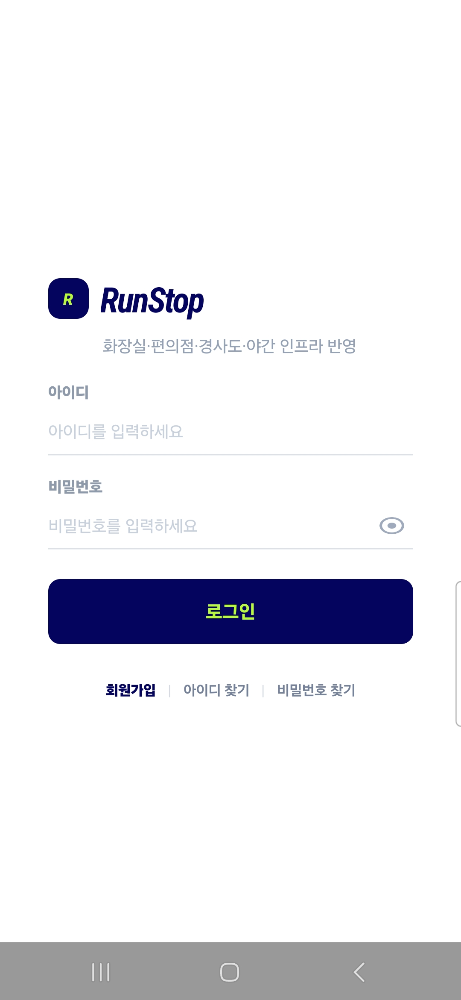
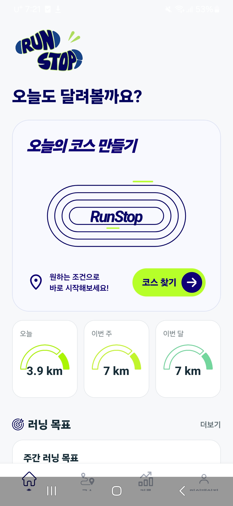
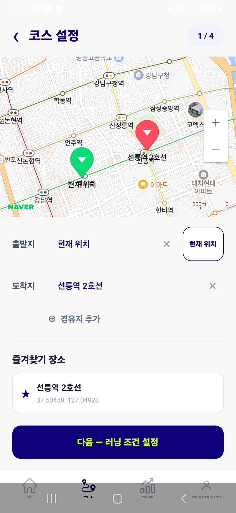
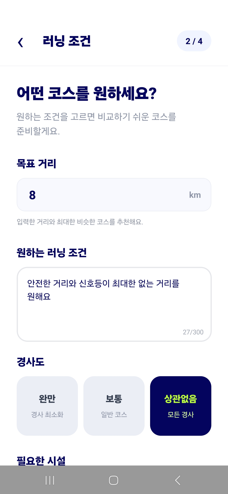
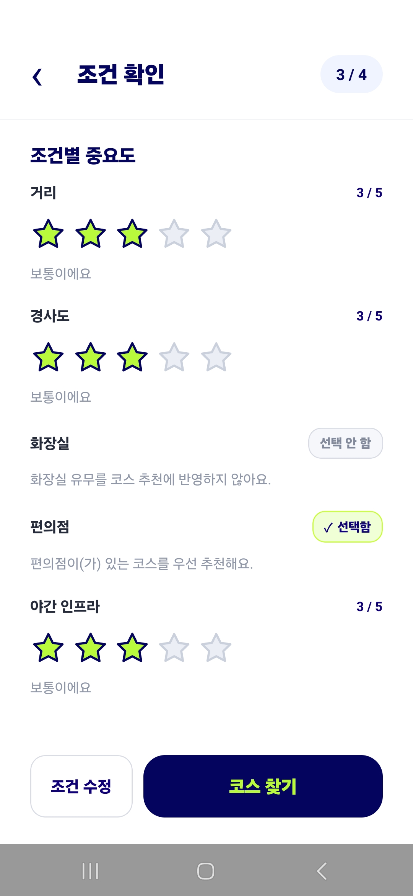
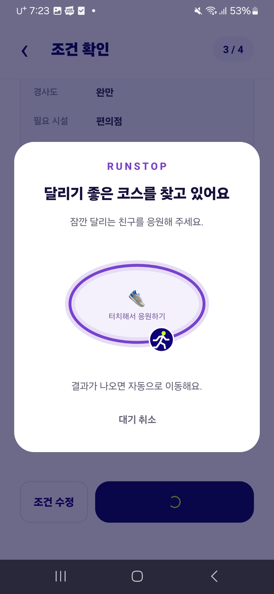
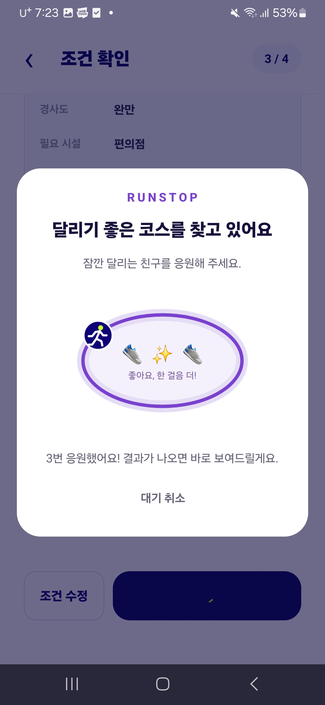
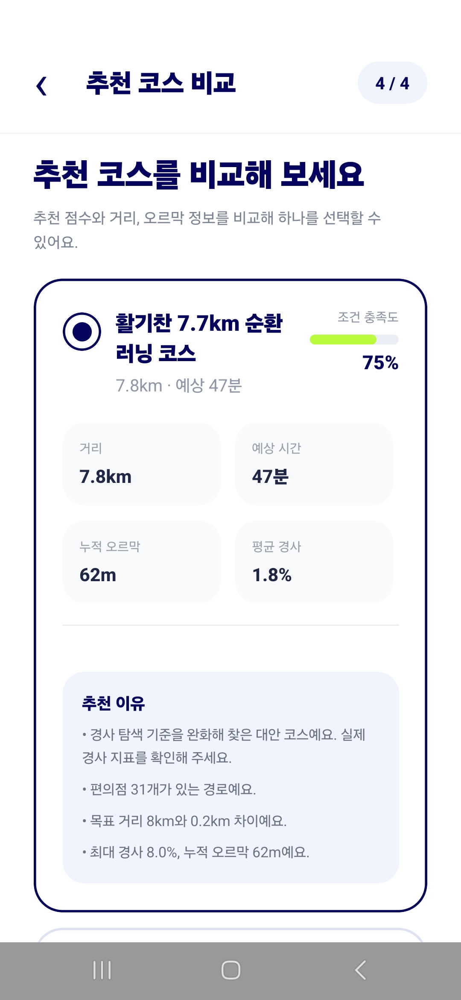
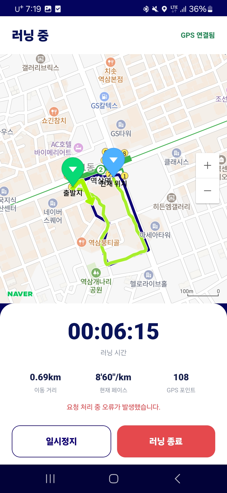
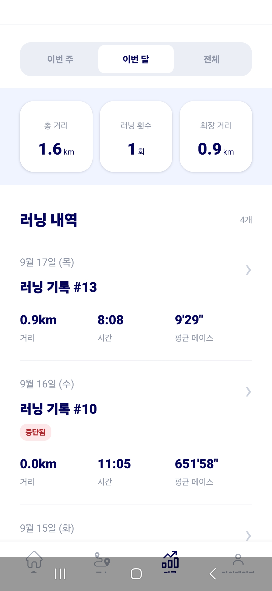

# RunStop

<h1 align="center">RunStop</h1>
<p align="center"><strong>나만의 러닝 코스</strong><br />거리·경사·주변 시설·야간 인프라를 반영하는 맞춤형 러닝 코스 추천 서비스</p>

## 📌 프로젝트 소개

현재 모바일 앱, Node API, Python 경로 추천 Worker, 관리자 웹이 구현되어 있습니다. Git 기록 기준으로 2026년 9월 16일 앱 2차 로컬 테스트 및 릴리스 작업을 진행했으며, 이후 기능 보완과 AI 평가 개선을 이어가고 있습니다.

---

## 🎯 프로젝트 목표

<table>
  <tr>
    <td align="center" nowrap><strong>인트로</strong><br /><a href="./assets/service-screenshot/1.jpg"></a></td>
    <td align="center" nowrap><strong>로그인</strong><br /><a href="./assets/service-screenshot/2.jpg"></a></td>
    <td align="center" nowrap><strong>홈 · 러닝 목표</strong><br /><a href="./assets/service-screenshot/3.jpg"></a></td>
    <td align="center" nowrap><strong>출발지 · 도착지 설정</strong><br /><a href="./assets/service-screenshot/6.jpg"></a></td>
    <td align="center" nowrap><strong>러닝 조건 입력</strong><br /><a href="./assets/service-screenshot/4.jpg"></a></td>
    <td align="center" nowrap><strong>조건별 중요도 확인</strong><br /><a href="./assets/service-screenshot/5.jpg"></a></td>
    <td align="center" nowrap><strong>추천 코스 비교</strong><br /><a href="./assets/service-screenshot/7.jpg"></a></td>
    <td align="center" nowrap><strong>코스 상세</strong><br /><a href="./assets/service-screenshot/8.jpg"></a></td>
    <td align="center" nowrap><strong>실시간 러닝</strong><br /><a href="./assets/service-screenshot/9.jpg"></a></td>
    <td align="center" nowrap><strong>러닝 테스트 · 오류 표시</strong><br /><a href="./assets/service-screenshot/10.jpg"></a></td>
    <td align="center" nowrap><strong>러닝 기록</strong><br /><a href="./assets/service-screenshot/11.jpg"></a></td>
  </tr>
</table>

## 주요 기능

| 영역 | 구현 내용 |
|---|---|
| 코스 설정 | 장소 검색, 현재 위치·출발지·도착지·경유지 설정, 순환·편도·왕복 코스 |
| 맞춤 추천 | 목표 거리, 경사, 화장실·편의점, 야간 인프라 등 조건 및 중요도 반영 |
| 자연어 입력 | LLM을 이용한 러닝 요구사항 구조화 및 서버 검증 |
| 코스 비교 | 최대 3개 후보의 지도, 거리, 고도·경사 정보, 조건 충족도 및 추천 이유 확인 |
| 러닝 | GPS 이동 경로 기록, 거리·시간·페이스 표시, 일시정지·종료, 진행 중 세션 복구, 코스 방향 표시 |
| 기록 관리 | 러닝 내역·통계, 목표 설정, 코스·장소 즐겨찾기 |
| 계정·문의 | 자체 회원가입·로그인, JWT 인증, SMS 인증 연동, 회원정보 관리·탈퇴, 문의 등록 |
| 관리자 | 관리자 로그인, 대시보드, 사용자·문의 관리 |

## 서비스 구조

---

Backend는 인증, 요청 검증, 외부 API 연동과 데이터 저장을 담당하고, Worker는 경로 생성과 평가·추론을 담당합니다. 모바일 앱은 Backend를 통해 서비스를 이용합니다. 운영 환경에서는 Caddy가 Backend 앞에서 HTTPS 요청을 전달합니다.

### 경로 추천과 AI

1. Backend에서 입력 조건과 자연어 요구사항을 정리합니다.
2. Worker가 서울 보행 그래프에서 코스 유형과 경유지를 반영한 후보를 생성합니다.
3. DEM 고도, 주변 시설, 녹지·하천, 도로 환경 특성을 계산하고 조건 점수를 부여합니다.
4. 학습된 모델로 후보 순위를 정해 최대 3개를 반환합니다. 모델 추론에 실패하면 조건 점수 순으로 선택합니다.

---

## 기술 구성

| 영역 | 기술 |
|---|---|
| 모바일 | React Native 0.86, Expo 57, React 19, TypeScript, Expo Router, Naver Map, Expo Location |
| 관리자 웹 | React 19, Vite 8, React Router, Axios |
| Backend | Node.js 24, TypeScript, Express 5, Zod, pg, JWT, bcrypt, Pino |
| Routing Worker | Python 3.12, FastAPI, NetworkX, NumPy 및 공간 데이터 처리 라이브러리 |
| AI 실험 | Logistic Regression, Random Forest, LightGBM, XGBoost, CatBoost, RankNet 등 비교 |
| 데이터베이스 | PostgreSQL 17, PostGIS 3.5, node-pg-migrate |
| 배포 | Docker Compose, Caddy |

버전은 저장소의 패키지 선언과 Dockerfile 기준입니다.

## 저장소 구성

```text
RunStop/
├─ frontend/
│  ├─ mobile/          모바일 앱
│  └─ admin/           관리자 웹
├─ backend/            API · 인증 · 비즈니스 로직 · 데이터 저장
├─ routing-worker/     경로 생성 · 특성 계산 · 점수화 · AI 추론
├─ ai/                 데이터 생성 · 모델 학습 · 평가 실험
├─ infra/db/           DB 마이그레이션 · 데이터 적재
├─ assets/             README용 앱 아이콘 · 서비스 스크린샷
├─ docs/               설계 · API 명세 · 회의 및 개발 문서
├─ notebooks/          분석 및 실험 노트북
├─ test/               팀원별 기술 검증 및 테스트 자료
├─ docker-compose.yml
├─ docker-compose.production.yml
└─ Caddyfile
```

## 개발 환경 실행

Docker Compose와 Node.js/npm이 필요합니다. 모바일 네이티브 빌드에는 Android SDK 또는 iOS 개발 환경이 필요하며, Worker를 직접 실행하거나 AI 실험을 할 때는 Python 3.12 환경을 준비합니다.

### API · Worker · DB

---

```powershell
Copy-Item .env.development.example .env.development
Copy-Item .env.production.example .env.production
```

`.env.development`의 DB 접속 정보와 `JWT_SECRET`을 설정합니다. 외부 서비스를 연결하지 않는 개발 환경은 `LLM_MODE=mock`, `SMS_API_ENABLED=false`로 설정할 수 있습니다. 사용하지 않는 선택 API 키 항목은 빈 값 대신 삭제하거나 주석 처리합니다. 현재 환경변수 검증에서 빈 문자열은 허용하지 않습니다.

```powershell
docker compose up -d --build database routing-worker backend
docker compose exec backend npm run db:migrate
```

현재 개발 Compose에도 Caddy가 선언되어 있어 `.env.production` 파일을 함께 준비하되, 위 명령에서는 개발용 세 서비스만 실행합니다. DB가 준비된 뒤 마이그레이션을 실행하세요.

- Backend 상태 확인: `http://localhost:3000/health`
- Worker 상태 확인: `http://localhost:8000/health`
- DB 접속 포트: `localhost:5432`

실제 코스 추천에는 보행 그래프, DEM, 시설·OSM 데이터가 필요합니다. 데이터 준비는 [Worker 데이터 안내](routing-worker/src/algo/data/README.md)를 참고하세요. 현재 Worker는 보행 그래프가 없으면 테스트용 격자 그래프를 사용합니다.

### 모바일 앱

`frontend/mobile/.env`에서 `EXPO_PUBLIC_API_BASE_URL`을 설정합니다. Android 에뮬레이터는 `http://10.0.2.2:3000`, 실기기는 접근 가능한 개발 PC의 LAN 주소 또는 배포 API 주소를 사용합니다.

```powershell
cd frontend/mobile
npm ci
npm run android
```

Naver Map 네이티브 모듈을 사용하는 개발 빌드입니다. `app.json`의 지도 클라이언트 설정을 확인하세요. 개발 빌드 설치 후에는 `npx expo start --dev-client`로 개발 서버를 실행할 수 있습니다.

### 관리자 웹

```powershell
cd frontend/admin
npm ci
npm run dev -- --port 5173
```

Backend와 포트가 겹치지 않도록 `5173`을 지정합니다. 현재 `vite.config.js`의 `/api` 프록시는 배포 서버를 가리키므로, 로컬 API에 연결하려면 `target`을 `http://localhost:3000`으로 변경합니다.

### 운영 배포

운영 구성은 [docker-compose.production.yml](docker-compose.production.yml)과 [Caddyfile](Caddyfile)을 사용합니다. `.env.production`에 DB·인증·외부 API 설정과 `API_DOMAIN`을 준비하고, 도메인이 서버를 가리키도록 설정합니다.

```powershell
docker compose -f docker-compose.production.yml pull
docker compose -f docker-compose.production.yml up -d
```

현재 운영 Compose는 레지스트리의 Backend·Worker 이미지를 사용합니다. 신규 DB의 마이그레이션과 데이터 적재는 별도로 진행해야 하며, 모바일 앱과 관리자 웹은 이 Compose에 포함되지 않습니다.

## 참여자

| 팀원 | 담당 영역 |
|---|---|
| 박건희 | 경로 생성 가중치 알고리즘, AI 추천 모델 |
| 윤재빈 | 데이터 전처리, 경로 점수화 |
| 최한빈 | 사용자 어플리케이션 개발, 프론트 설계 |
| 이승연 | 관리자 페이지 개발, 프론트 설계 | 
| 허완 | 서비스 아키텍처/DB/서버 설계, 프로젝트 문서화, AI 추천 모델 |

## 개발 기록

- [2026-09-17] AI 평가 지표·자원 측정 및 관리자 API 프록시 설정 보완.
- [2026-09-16] 앱 2차 로컬 테스트 완료, 릴리스 및 오류 수정.
- [2026-09-15] 앱·서버·알고리즘·AI 통합 및 배포, LLM·SMS 연동, 세션 복구·코스 방향 표시와 거리 집계 개선.
- [2026-09-14] 추천 코스 실제 데이터 연결, AI 자동화 작업, 추천 및 러닝 종료 처리 개선.
- [2026-09-13] 운영 Compose 작성, 프론트·Worker 통합 및 AI 실험 환경 구성.
- [2026-09-12] AI 평가·데이터 생성 전략 정리, 프론트 화면과 스타일 수정.
- [2026-09-11] LLM 어댑터·장소 검색 구현, 경로 추천 스키마 정리 및 모바일 통합.
- [2026-09-10] 알고리즘 2차 병합, 경로 생성·특성 추출 개선 및 관리자 기능 구현.
- [2026-09-08] 모바일 메인 앱·관리자 대시보드 추가, Naver Map 개발 빌드 설정.
- [2026-09-07] 관리자 로그인·문의 화면 추가, 알고리즘 코드 검토.
- [2026-09-06] Node·FastAPI·알고리즘 연동, 회원 탈퇴 기능 추가.
- [2026-09-05] 경로 추천 알고리즘 리뷰 및 테스트.
- [2026-09-02] 인증·사용자 API 구현 및 Node API·어댑터 골격 정리.
- [2026-09-01] 서버 구조 및 인증 기능 구현 시작.
- [2026-08-31] DB ERD 및 마이그레이션 작업.
- [2026-08-30] 저장소 구조·Docker 실행 환경 구성, Node·Python 통신 검증.
- [2026-08-28] 데이터 모듈·PostGIS 테스트 및 팀 작업 취합.
- [2026-08-27] 경사도 계산 모듈 공유 및 진행 상황 정리.
- [2026-08-26] DB·UI·알고리즘 설계 구체화 및 역할 정리.
- [2026-08-24] 기획안 기반 서비스 설계 구체화.
- [2026-08-23] 프로젝트 시작.

## 관련 문서

- [Backend API 명세](docs/04_Node_서버_설계/API/README.md)
- [Worker 설계 문서](docs/06_router-worker_명세/README.md)
- [AI 실험 환경 및 실행 방법](ai/README.md)
- [서울 공간 데이터 안내](routing-worker/src/algo/data/README.md)
- [전체 문서](docs/)
