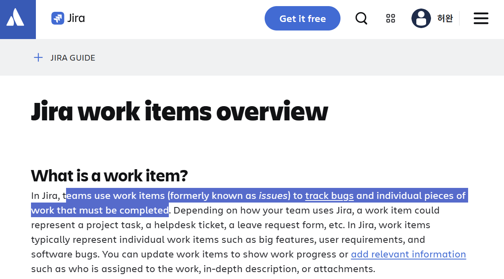
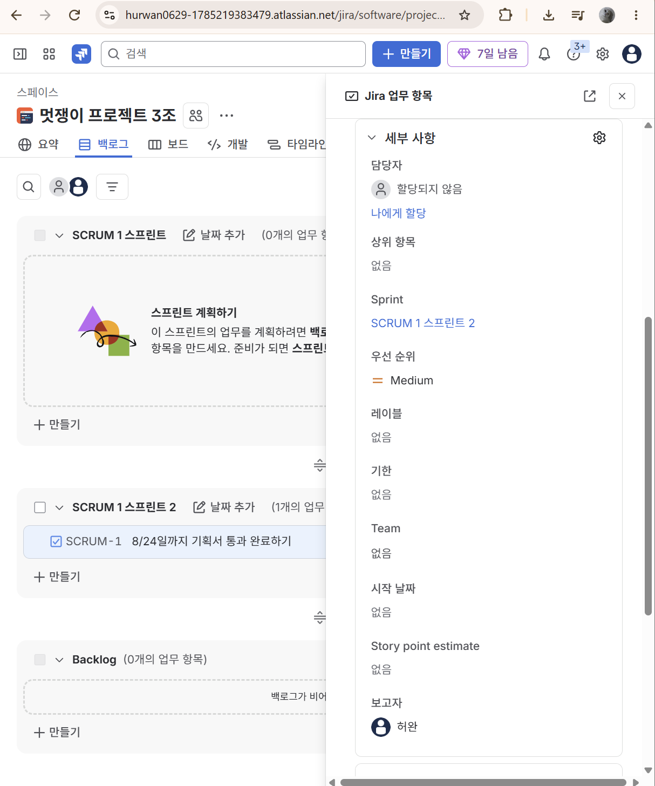
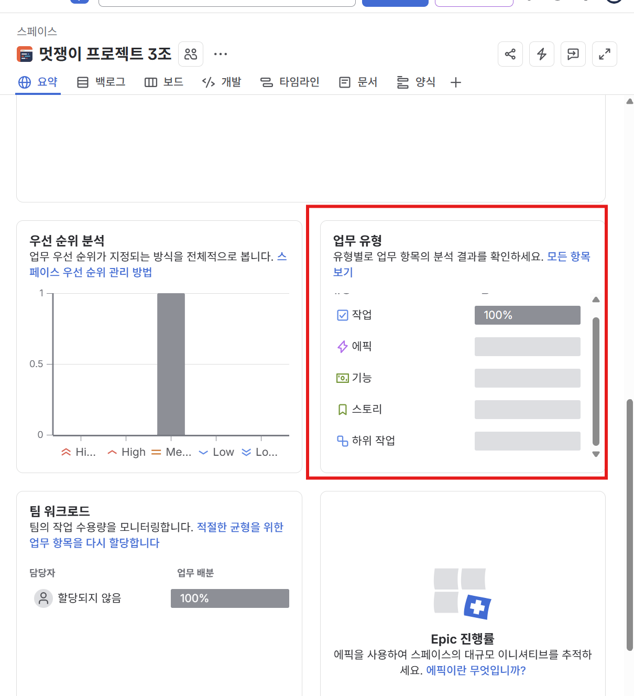
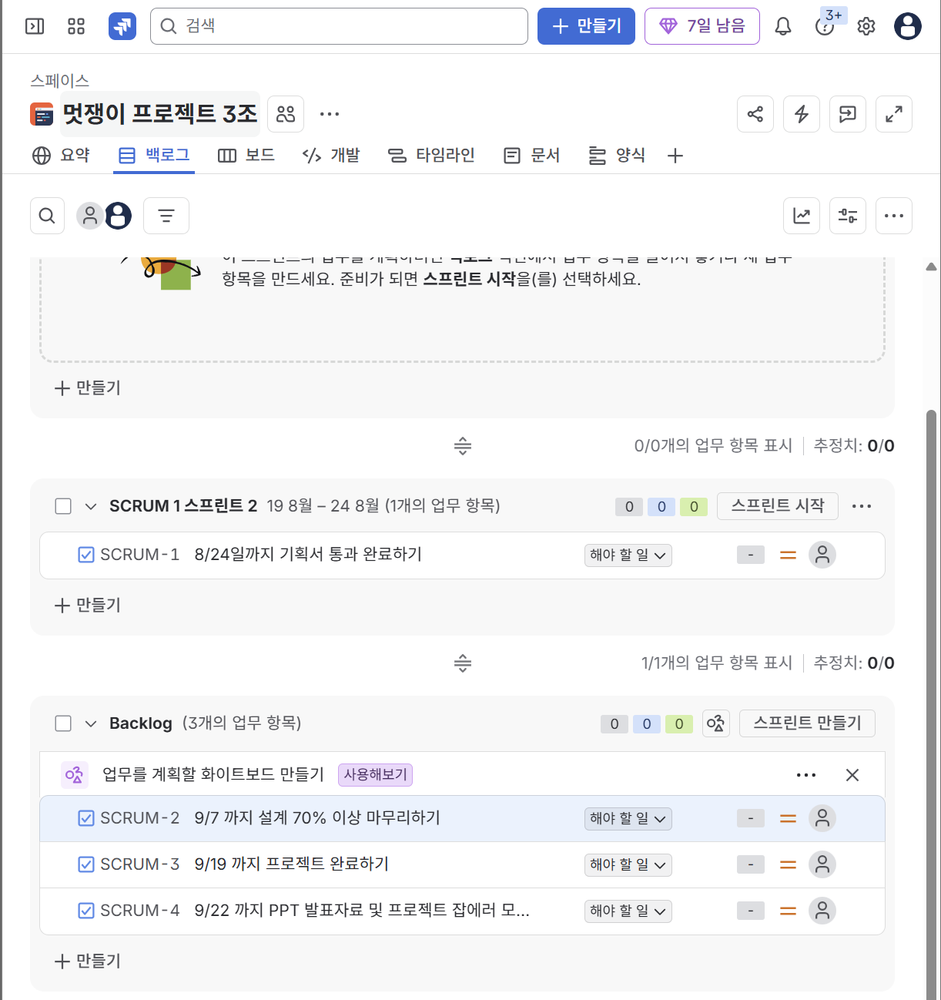
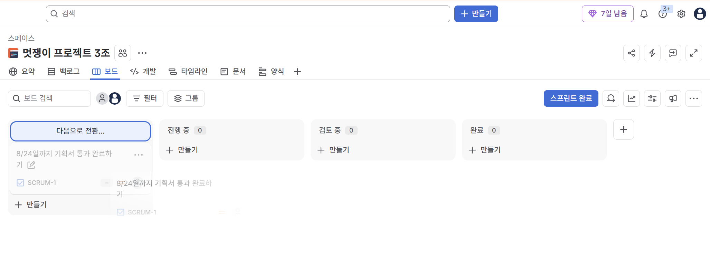
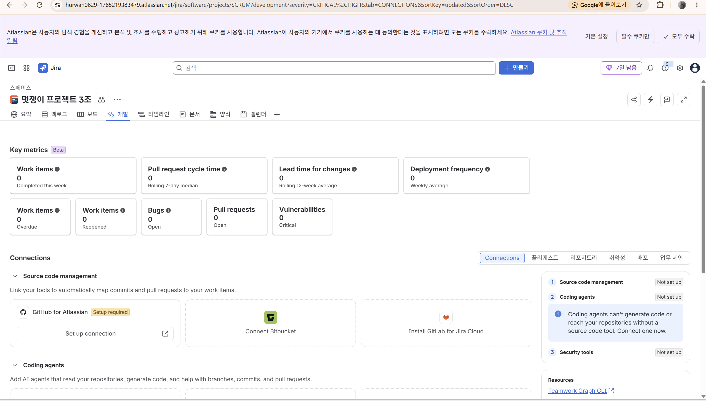
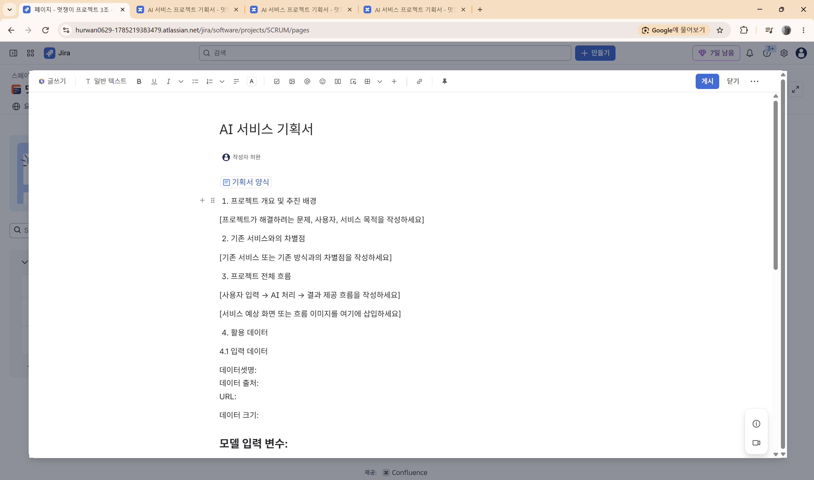
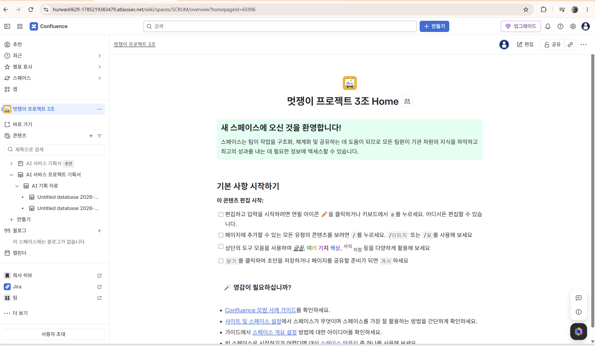
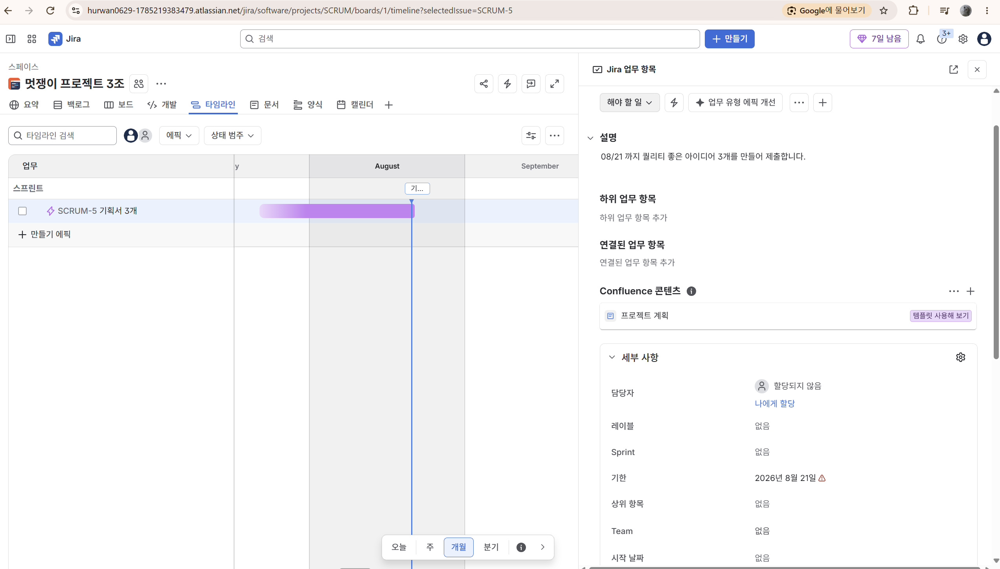

# Jira 공부
> 이번에는 협업을 위한 Jira 툴을 사용하기 위해 기능들에 대해 알아보았습니다.

## 이슈에 대해서
일단 **이슈**라는 단어에 대해서 정리하고 시작하려고 합니다.

Jira의 경우에는 공식문서 상에는 **Work item**이라는 **작업 항목**이라는 단어를 주로 사용하지만 현업에서는 GitHub도 그렇고 **Issue**라는 단어를 많이 사용합니다.

예를 들면 `A프로젝트`에서 `로그인 기능 구현`, `이미지 비동기처리 기능 수정`, `API 인터페이스 구현` 등이 이슈가 될 수 있습니다.

그리고 각각의 Issue에는 보통 다음과 같은 항목이 들어갑니다.

- 제목
- 설명
- 담당자
- 상태
- 우선순위
- 시작일
- 마감일
- 댓글
- 첨부파일
- 하위 작업
- 연결된 다른 Issue

### Issue의 종류
Jira에서는 주로 다음과 같은 종류의 Issue가 존재합니다

| 종류 | 의미 | 예시 |
| --- | --- | --- |
| Epic | 큰 기능/큰 작업 묶음 | 웹 서비스 플랫폼 구출 |
| Story | 사용자에게 제공되는 기능 | 사용자가 웹에 접속하여 정적 파일 제공 후 서버의 응답까지 정상적으로 받는다. |
| Task | 해야 할 일반 작업 | 백엔드와 프론트엔드의 CI/CD 파이프라인을 구축한다 |
| Bug | 고쳐야 할 문제 | `frontend-ci.yml` Environment 수정하기 |
| Sub-task | Task 등을 더 잘게 나눈 것 | `backend-ci.yml` 작성 |

## 백로그
백로그는 앞으로 해야 할 일들을 쌓아놓는 작업 대기실을 의미합니다.

Scrum에서는 프로젝트에서 할 가능성이 있는 작업들이 Backlog에 있고, 그 중에서 이번 Sprint 할 것만 골라 Sprint로 가져오게 됩니다.

> **백로그**는 `앞으로 해야할 일 목록`, **스크럼**은 `팀이 일하는 방식/프레임워크`, **스프린트**는 `실제로 집중해서 개발하는 일정 기간`을 의미합니다. 백로그에 저장해놓고, 스프린트를 해가며 리뷰방식, 회고, 회의 등에 대해서 어떻게 진행할 것인가를 스프린트라고 부를 수 있습니다.

## 보드
보드 칸에는 Status가 존재합니다.

이 기본값은 가로로 
1. 해야할일
2. 진행중
3. 검토중
4. 완료

형태로 나열되어있으며 직접 드래그를 통해 상태를 이동시킬 수 있습니다.

> Status는 개수를 수정하거나 이름을 바꿀 수 있으며 이를 통해 프로세스의 프레임을 변경시킬 수 있습니다.

> 이러한 Status의 이동 규칙 전체를 워크플로우라고 합니다.

## 개발
> 개발 탭은 외부 개발도구와 연결을 통해 업무와 실제 개발 기록을 연결하는 번호입니다. 주로 PR, Branch, Deploy, Commit 등을 Jira에서 확인할 수 있게 만들 수 있습니다.

## Confluence
기획서, 회의록, 설계서, 문서 등을 Jira에서 연동되는 Confluence 를 이용하여 처리할 수 있습니다.

Jira의 **문서** 탭으로 이동하게 되면 다음과 같이 문서를 작성할 수 있습니다.

여기에서 atlassian에서 제공하는 Confluence 를 함께 이용하여 문서를 체계적으로 자동화시킬 수 있습니다.

## 타임라인
소프트웨어 공학의 간트차트와 유사하며 어떤 작업들을 했는지에 대한 기록과 내용을 담을 수 있습니다.

