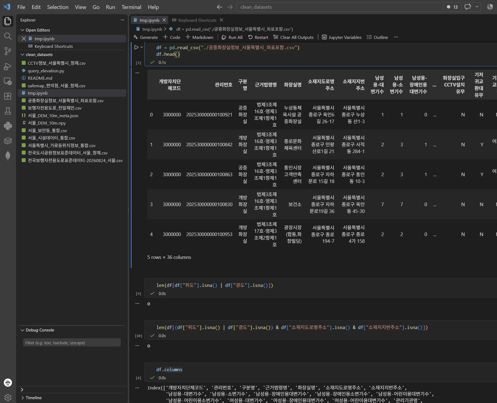

# [랭체인 중간프로젝트] 데이터베이스 datasets 스키마 설계

우선 현재 프로젝트에서 사용하는 데이터베이스는 `PostgreSQL` + `PostGIS` 입니다.

그리고 데이터베이스 안에는 스키마를 2개로 나누어 사용할 예정입니다.
- `service`: 서비스를 주로 사용할 데이터베이스
- `datasets`: `.csv` 등의 데이터를 직접 넣어서 사용할 데이터

이번에는 두 스키마중 `datasets` 스키마에 대해서 재빈님(팀원)이 준비해주신 데이터 정제본을 확인하며 설계를 해보겠습니다.

전체적으로 잘 등록되어있으며 일부 행이 없는 것을 제외하고는 모두 잘 존재하는 것을 확인하였습니다. (하지만 지번 및 도로명 주소가 있어서 확인 사항입니다.)

## 데이터 확인
일단 존재하는 데이터의 종류는 다음과 같습니다. (개수 기준 정렬)
- 시설 데이터 통합: (아래 데이터 모두 통합) 약 27.6만건
- 보안등: 약 18만건
- CCTV: 약 6만건
- 가로등: 약 1.9만건
- 편의점: 약 0.95만건
- 공중화장실: 0.56만건
- 도시공원: 약 0.18만건
- 보행자 전용도로: 96건
  - 보행자 전용도로 전일제: 46건

여기에서 보행자 전용 도로는 제외하고 시설 데이터 통합 데이터의 경우에는 컬럼이 `유형,명칭,위도,경도,자치구,주소,비고` 으로 간단하게 나뉘어져있습니다.

데이터베이스에 저장할 데이터는 다음과 같습니다.

### Point 타입
- 보안등
- CCTV
- 가로등
- 편의점
- 공중화장실

### LineString 타입
- 보행자 도로

### Polygon 타입
- 공원 데이터