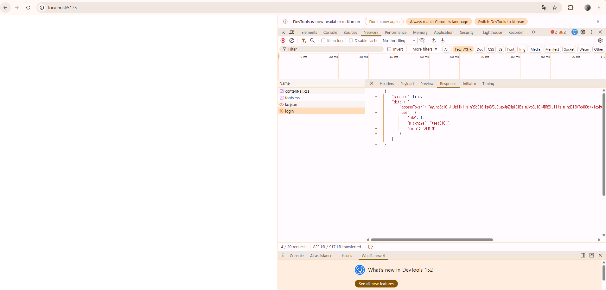

# 프론트 커밋 받아서 읽으면서 작성
> 현재 [front/admin](https://github.com/hurwan0629/RunStop/commit/39b313f1cf97b309d049abf6dcb3d44c9f494b02)코드를 받아서 리뷰중입니다.

우선 라우터부터 확인하였습니다.

페이지는 총 3개 존재하는 것으로 보이며 

- `/login`: 로그인
- `/dashboard`: 대시보드
- `/inqueries`: 문의

가 존재합니다.

파일에 `UserDetailPage`와 `UserPage`가 존재하지만 아직 작업 전 영역(백엔드도 만들어져있지 않았었음)이기 때문에 현재 구현 전 영역입니다.

실제로 회원 관리 페이지가 있는데 현재 개발중인 것으로 확인됩니다.

## 로그인 페이지
아직 css는 적용하지 않았으며 localStorage에 adminAccessToken을 저장하는 방식으로 확인됩니다. 현재 프로젝트의 웹은 그냥 보여주기 위한 환경이기 때문에 큰 신경은 쓰지 않았습니다. 주석이 되어있는데 import jwt 때문에 그렇다고 나와있습니다. 현재 수정되어있는 상태입니다.

로그인 페이지의 경우에는 로그인 의 `role`과 `accessToken`을 잘 받아서 처리하는 것으로 보입니다.

현재 관리자 데이터를 넣는 방법이 없어서 임시로 관리자 데이터를 넣은 뒤 사용할 예정입니다.

현재 테스트 사용자를 회원가입한 상태로 sql을 이용해서 사용자 `role=ADMIN`으로 변경하여 실행하였더니 로그인 잘 되는것 까지 확인하였습니다.




## 루트 페이지
사실상 로그인 페이지의 링크가 `/` 였긴 한데 로그인 한 이후 `/`로 이동하여 아무것도 남지 않는 상태가 됩니다.

## `/dashboard` - 대시보드

대시보드 또한 아직 구현 전인 미완성 영역입니다.

## `/inqueries` - 문의

문의 관련 작업은 현재 코드가 어느정도 구현되어있는 것으로 보입니다.

일단 페이지로 직접 url을 치고 들어가보면 보이는 화면은 없습니다.

api url 또한 분리되어있어 나중에 한번에 정리하기 좋은 형태인 것 같습니다.

`/inqueries/:idx` 형태에서 404 처리는 없지만 딱히 중요하게 여기지 않았습니다.


요청 초반에 `useEffect`를 이용해서 상태를 처리해주며 이때 여러 에러 처리도 되어있는 것을 확인하였습니다.

useMemo를 이용한 문의 요청 결과인 `inquiries`와 검색어에 들어가는 `keyword`가 존재한다.

현재 문의쪽에 제목을 제외한 내용에 대한 검색도 피그마에 나와있었는데 이부분은 향후 수정하거나 제목만으로 결정할 것 같다.

상태를 `docs`에 명시하지 못했는데 잘 설정되어있다.

`PENDING, IN_PROGRESS, ANSWERED`


문의 상세를 누르면 `selectedInquiryIdx`을 이용해서 `Drawer`를 변경해주며 `onUpdated` 함수를 인자로 주어 처리합니다. (그런데 실제로 쓰이진 않습니다.)

실제로 상태를 변경하는 함수는 `handleStatusChange` 입니다.

여기에서 상태가 이미 `ANSWERED`인 경우에는 서버에서는 막지 않지만 프론트에서 상태 변경을 막아줍ㄴ디ㅏ.


## 회원 관리 페이지 관련 기능
현재 회원 정지 기능은 존재하지만 관리자의 사용자 조회 요청에 대해서 처리하는 로직은 존재하지 않습니다.

아마 `/api/users/admin-dashboard?page=?limit=?query=?`와 같은 형식이 추가적으로 필요할 것으로 보입니다.


현재 만들어져있는 `api`는 다음과 같습니다.

``````md
# 회원 정지

관리자가 회원을 기간 정지 또는 영구 정지하고 기존 관리자 메모에 사유를 추가합니다.

## 엔드포인트

- `PATCH /api/admin/users/suspension`

## 요청 스키마

```json
{
  "userIdx": 123,
  "suspendedUntil": "2099-09-13T18:00:00+09:00",
  "reason": "반복적인 운영 정책 위반"
}
```

- 모든 필드는 필수입니다.
- `userIdx`: 양의 정수인 회원 idx.
- `suspendedUntil`: 미래의 ISO 8601 종료 시각. `Z` 또는 시간대 오프셋이 필요합니다. 예시 날짜는 실제 종료 시각으로 바꿉니다.
- `suspendedUntil: null`이면 영구 정지입니다. 필드 생략은 허용하지 않습니다.
- `reason`: 앞뒤 공백 제거 후 1~2000자의 한 줄 문자열입니다.
- 이미 정지된 회원도 요청할 수 있습니다. 종료 시각을 새 값으로 바꾸고 사유를 추가합니다.

## 응답 스키마

```json
{
  "success": true,
  "data": {
    "userIdx": 123,
    "status": "SUSPENDED",
    "suspendedUntil": "2099-09-13T09:00:00.000Z"
  }
}
```

영구 정지 응답의 `suspendedUntil`은 `null`입니다. 날짜 응답은 UTC입니다.

## 인증/권한

- `authenticate` 이후 `requireAdmin`을 적용합니다.
- Bearer JWT가 필요하며 DB에서 확인한 현재 권한이 `ADMIN`이어야 합니다.

``````