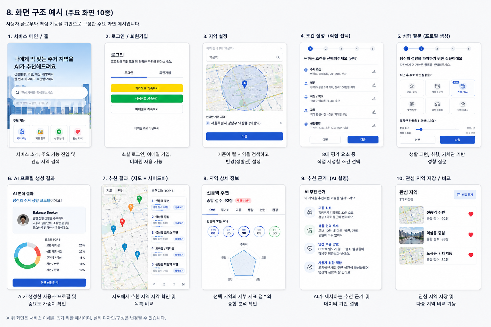

# 청년 맞춤형 주거지역 추천 서비스

## 사용자 성향 분석과 지역 특성 기반의 주거 생활권 추천

### 서비스 한 줄 정의

> 청년 사용자의 주거 조건과 생활 성향을 분석하고, 지역별 주거·교통·생활·안전·환경 데이터를 비교하여 사용자가 지정한 범위 내에서 적합한 주거 생활권을 근거와 함께 추천한다.

**작성일:** 2026.08.18

---

## 기획 핵심

* 매물뿐 아니라 **매물이 위치한 지역과 생활권**까지 함께 분석한다.
* 사용자가 직접 설정한 조건을 우선 반영하고, 미설정 영역은 AI가 성향을 추정한다.
* AI가 성향을 판단한 이유를 설명하고 사용자가 직접 수정할 수 있게 한다.
* 사용자 성향과 지역 특성을 근거 기반으로 결합하여 **추천 지역과 선택 이유**를 제공한다.

---

# 1. 서비스 개요 및 문제 정의

## 1.1 배경 및 문제

주거지역을 선택할 때 사용자는 가격과 주택 유형뿐 아니라 통근, 안전, 생활시설, 소음, 커뮤니티, 취미, 장기 거주계획 등 다수의 조건을 동시에 고려해야 한다.

그러나 이러한 정보는 공공데이터, 지도, 부동산 서비스, 지역 커뮤니티 등 여러 서비스에 분산되어 있어 사용자가 직접 자료를 수집하고 지역별로 비교하는 데 많은 시간과 노력이 필요하다.

특히 사용자가 원하는 조건이 명확하더라도 **어떤 지역이 자신의 생활방식과 잘 맞는지 판단하기 위해서는 주택 자체의 정보뿐 아니라 주변 지역에 대한 다면적인 분석이 필요하다.**

## 1.2 해결 방향

사용자가 원하는 탐색 범위를 먼저 지정하면 서비스가 해당 범위 안의 세부 생활권을 분석한다.

사용자가 직접 지정한 조건은 우선적으로 반영하고, 선택하지 않은 영역은 성향 질문과 사용자가 제공한 정보를 바탕으로 AI가 **사용자 성향 프로필**을 생성한다.

이후 미리 구축된 **지역별 특성 데이터**와 사용자 성향을 비교하여 지역별 적합도를 계산하고, 추천 결과와 추천 이유를 지도 중심의 UI로 제공한다.

### 핵심 가치

> “좋은 동네”를 일반화하지 않고, 특정 사용자에게 **왜 이 지역이 더 적합한지**를 데이터와 설명으로 보여준다.

## 1.3 서비스가 해결해야 할 기술적 문제

* 지역의 주거·교통·생활·안전·환경 등 다양한 특징을 안정적으로 수치화할 수 있어야 한다.
* AI가 추정한 사용자 성향이 실제 사용자의 선호와 크게 어긋나지 않아야 한다.
* 하나의 정보만으로 사용자의 성향과 지역 적합도를 과도하게 판단하지 않아야 한다.
* 예를 들어 사용자가 러닝을 선호하더라도 `러닝 크루 수` 하나만으로 해당 지역의 러닝 적합도를 판단해서는 안 된다.
* 추천 결과가 부정확한 경우 **사용자 입력, 성향 추론, 지역 데이터, 가중치 중 어느 부분에서 오류가 발생했는지 추적 가능해야 한다.**
* 사용자 성향과 지역 특성을 어떤 기준으로 연결하며, 그 기준이 실제 사용자 만족도와 일치하는지 검증할 수 있어야 한다.

---

# 2. 대상 사용자

## 주요 타깃

> **독립·이사·취업 등의 이유로 새로운 주거지역을 탐색하는 청년층 중, 원하는 생활 조건은 존재하지만 여러 지역의 정보를 직접 찾아 비교하기 어려운 사용자**

## 대표 이용 상황

| 상황 | 사용자 요구 및 서비스 제공 가치 |
| --- | --- |
| **첫 독립** | 예산은 정해져 있지만 어떤 지역이 자신의 생활방식에 적합한지 모르는 사용자에게 예산·통근·생활환경을 함께 비교해준다. |
| **취업 / 이직** | 직장 위치가 변경되어 낯선 지역을 탐색하는 사용자에게 출근 빈도와 실제 통근 부담을 반영한 지역을 추천한다. |
| **이사** | 현재 거주지역의 소음·환경·생활편의 등에 불만이 있는 사용자에게 기존 지역과 후보 지역의 특성을 비교해준다. |
| **생활패턴 변화** | 운동, 차량 구매, 동거, 결혼 등 생활 조건이 변경된 사용자에게 변화한 성향과 장기 거주계획을 반영하여 다시 추천한다. |

---

# 3. 서비스 특징 및 차별점

| 구분 | 일반적인 매물 탐색 | 제안 서비스 |
| --- | --- | --- |
| **기준을 정하는 주체** | 사용자가 지역과 검색조건을 대부분 직접 결정  | 사용자가 탐색 범위와 원하는 조건을 정하고, 미설정 영역은 AI가 보완 |
| **평가 대상** | 가격·면적·주택유형 등 매물 자체의 조건 중심 | 집 + 위치 + 주변 생활권의 다양한 지역 특성 |
| **추천 결과** | 조건과 일치하는 매물 목록 | 개인별 주거 생활권 Ranking + 추천 이유 |
| **설명 가능성** | 입력한 필터와의 일치 여부 | 사용자 성향 판단 근거 + 지역 데이터 근거 + 추천 이유 |

## 다루고 싶은 지역 특성 예시

* 지역 커뮤니티 및 활동성
* 치안과 CCTV 등 안전
* 환경·청결·쾌적성
* 소음 및 혼잡도
* 날씨·열환경·침수 등 환경 위험
* 상권·생활편의·의료·공원
* 교통·통근·이동 접근성
* 주택유형·가격·공급 특성

---

# 4. 주요 사용자 플로우 및 핵심 기능

## 주요 사용자 플로우

**서비스 진입**

↓

**회원가입 / 로그인 또는 비회원 이용**

↓

**탐색하고 싶은 지역 범위 설정**

↓

**사용자가 원하는 조건 직접 설정**

↓

**미설정 영역을 보완하기 위한 성향 질문**

↓

**AI 사용자 성향 프로필 생성**

↓

**사용자 프로필 확인 및 수정**

↓

**추천 실행**

↓

**후보 지역별 적합도 계산 및 Ranking**

↓

**지도 + 사이드바 형태로 추천 지역 제공**

↓

**추천 지역 상세정보 및 추천 이유 확인**

## 4.1 핵심 기능

| 기능                | 설명                                                                                              |
| --- | --- |
| **탐색 지역 설정** | 서울·자치구·행정동·역·반경 등 사용자가 원하는 대략적인 탐색 범위를 지정한다. |
| **직접 조건 설정** | 예산·통근·주택형태·필수시설·안전조건 등 사용자가 중요하게 생각하는 조건을 원하는 만큼 지정한다. |
| **성향 질문** | 사용자가 직접 설정하지 않은 영역을 추정하기 위한 짧은 상황형·선택형 질문을 제공한다. |
| **AI 사용자 프로필 생성** | 사용자의 중요도·선호·회피조건 등을 구조화하고, 각 성향을 판단한 이유를 함께 제공한다. |
| **프로필 수정** | AI가 판단한 성향을 사용자가 직접 수정하거나 고정할 수 있도록 한다. |
| **지역 Ranking** | 후보 생활권의 지역 특성과 사용자 성향을 비교하여 개인별 적합도를 계산한다. |
| **지도 / 사이드바** | 추천 지역과 대표 점수·특징을 지도와 목록에서 함께 비교할 수 있도록 제공한다. |
| **프로필 영속화** | 회원의 사용자 성향 프로필과 직접 설정한 조건을 DB에 저장하고 이후 추천에서도 다시 사용할 수 있도록 한다. 비회원은 현재 추천 과정에서 필요한 정보를 임시로 유지한다. |

---

# 5. 추천 평가요소 및 사용자 성향 프로필

추천 영역은 우선 **8개의 기본 영역**으로 구성하고, 이후 새로운 생활패턴과 취향 요소를 추가할 수 있는 구조로 설계한다.

| 평가 영역         | 내용                                                                                                                              |
| --- | --- |
| **① 주거조건** | **직접 질문:** 주택유형, 면적, 방 수, 주차, 준공연도<br>**AI 추론:** 주거 밀도 선호, 신축 선호 정도<br>**지역 특성:** 주택유형 비율, 평균 면적, 건축연도 분포 |
| **② 예산** | **직접 질문:** 전세/월세, 보증금, 월세, 관리비 한도<br>**AI 추론:** 주거비에 대한 민감도<br>**지역 특성:** 평균·중앙 전월세 가격, 가격 분포 |
| **③ 직장** | **직접 질문:** 직장 위치, 출근 빈도, 향후 이직 고려 여부<br>**AI 추론:** 직주근접 중요도<br>**지역 특성:** 직장까지의 이동시간·거리, 주요 업무지역 접근성 |
| **④ 교통** | **직접 질문:** 최대 통근시간, 주 교통수단, 환승 허용 횟수<br>**AI 추론:** 환승·도보·장거리 이동에 대한 민감도<br>**지역 특성:** 지하철역·버스정류장 접근성, 이동시간, 환승 횟수 |
| **⑤ 생활환경** | **직접 질문:** 병원, 마트, 공원, 상권 등 중요 시설<br>**AI 추론:** 생활시설 접근성 및 생활권 밀도 선호<br>**지역 특성:** 시설 개수·거리·밀도, 도보 생활권 접근성 |
| **⑥ 취향** | **직접 질문:** 운동, 영화, 서점, 음식, 게임, 자전거 등<br>**AI 추론:** 활동 중심/정적 생활, 실내·야외 활동 선호, 야간활동 성향 등<br>**지역 특성:** 관련 생활시설, 문화시설, 운동시설, 활동 공간 |
| **⑦ 안전 / 환경** | **직접 질문:** 치안, CCTV, 소음, 침수, 환경위험 회피 정도<br>**AI 추론:** 위험 회피 성향과 안전 민감도<br>**지역 특성:** 방범시설, CCTV, 범죄 관련 지역 통계, 소음, 침수 이력, 대기환경   |
| **⑧ 거주계획** | **직접 질문:** 예상 거주기간, 독립·동거, 결혼, 차량 구매계획<br>**AI 추론:** 장기 거주 적합성 중요도<br>**지역 특성:** 주차환경, 주거면적, 생활기반시설, 교통 이동성 |
| **+ 추가 영역** | 반려동물, 야간근무, 학업, 카페 이용, 특정 문화생활 등 향후 새로운 생활패턴을 추가할 수 있도록 확장한다. |

## 5.1 직접 선택과 AI 추정의 우선순위

### 기본 원칙

> **사용자가 직접 선택한 조건 > AI가 추정한 조건**

사용자가 직접 지정한 값은 필수 조건 또는 높은 가중치를 가진 조건으로 처리한다.

AI가 추정한 성향에는 **추정 신뢰도**를 함께 저장하고, 신뢰도가 낮은 추정 결과가 전체 추천에 지나치게 큰 영향을 주지 않도록 설계한다.

### 예시

사용자가 `통근시간 40분 이내`를 직접 지정한 경우에는 40분을 초과하는 후보 지역을 제외할 수 있다.

반면 AI가 사용자의 응답을 바탕으로 `야외 운동 선호도가 높다`고 추정한 경우에는 이를 추천 점수에 반영하되, 직접 선택한 조건보다 낮은 우선순위로 반영한다.

---

# 6. 지역 특성 설계 및 활용 데이터

> 데이터의 구체적인 컬럼들은 [여기(링크)](./06_datas_api.md)에 기재되어있습니다.

지역 데이터는 단순히 수집하는 것이 아니라 **각 지역을 비교할 수 있는 공통된 세부 지표로 변환**하여 저장한다.

초기 서비스에서는 서울 지역을 기준으로 데이터 확보 가능성과 공간 단위를 확인한 뒤 실제 활용 데이터를 확정한다.

## 6.1 주거 / 부동산 데이터

| 항목 | 내용 |
| --- | --- |
| **예상 데이터** | 보증금, 월세, 거래금액, 면적, 주택유형, 건축연도 |
| **데이터 형태** | 수치형 / 범주형 |
| **단위** | 원, 만 원, ㎡, 연도 |
| **공간 단위** | 건물, 법정동, 행정동, 생활권 |
| **데이터 소스 후보** | [국토교통부 아파트 전월세 실거래가 API](https://www.data.go.kr/data/15126474/openapi.do)<br>[국토교통부 연립·다세대 전월세 실거래가 API](https://www.data.go.kr/data/15126473/openapi.do)<br>[국토교통부 오피스텔 전월세 실거래가 API](https://www.data.go.kr/data/15126475/openapi.do)<br>[국토교통부 단독·다가구 전월세 실거래가 API](https://www.data.go.kr/data/15126472/openapi.do) |

국토교통부의 전월세 실거래가 API는 지역코드와 계약연월을 기준으로 실제 신고된 임대차 자료를 조회할 수 있어 지역별 임대료와 주택유형 분석의 기초 데이터로 활용할 수 있다.

## 6.2 교통 / 통근 데이터

| 항목 | 내용 |
| --- | --- |
| **예상 데이터** | 지하철역·버스정류장 위치, 노선, 이동시간, 도보시간, 환승 횟수 |
| **데이터 형태** | 좌표 / 수치 / 경로 |
| **단위** | m, km, 분, 횟수 |
| **공간 단위** | 정류장, 역, 경로, 생활권 |
| **데이터 소스 후보** | [서울시 버스정류소 위치정보](https://data.seoul.go.kr/dataList/OA-15067/S/1/datasetView.do)<br>[서울 열린데이터광장 지하철역 정보](https://data.seoul.go.kr/dataList/32/literacyView.do)<br>[카카오 경로 조회 API](https://developers.kakao.com/docs/ko/rest-api/reference) |

서울시는 버스정류소 위치와 지하철역 관련 정보를 제공하고 있으며, 지도 API를 함께 활용하면 출발지와 목적지 사이의 대중교통·도보·자전거 경로 등을 추천 계산에 활용할 수 있다.

## 6.3 생활시설 / 상권 데이터

| 항목 | 내용 |
| --- | --- |
| **예상 데이터** | 병원, 약국, 마트, 공원, 체육시설, 영화관, 서점, 음식점, 문화시설 |
| **데이터 형태** | 좌표 / 범주 |
| **단위** | 개수, 거리, 밀도 |
| **공간 단위** | 시설 위치, 일정 반경, 생활권 |
| **데이터 소스 후보** | [카카오 로컬 장소 검색 API](https://developers.kakao.com/docs/ko/local/dev-guide)<br>[서울시 공공서비스예약 정보](https://data.seoul.go.kr/dataList/OA-2271/A/1/datasetView.do)<br>[서울시 골목상권 분석정보](https://data.seoul.go.kr/dataList/3/literacyView.do) |

카카오 로컬 API는 장소명·주소·좌표·분류 정보를 제공하고, 서울시 상권분석 데이터에는 상권별 점포·집객시설·인구 등 다양한 생활권 관련 정보가 포함되어 있어 생활시설 접근성과 상권 특성 계산에 활용할 수 있다.

## 6.4 안전 데이터

| 항목 | 내용 |
| --- | --- |
| **예상 데이터** | 방범 CCTV, 안전시설, 범죄 관련 지역 통계 |
| **데이터 형태** | 수치 / 좌표 / 통계 |
| **단위** | 개수, 밀도, 발생 건수 |
| **공간 단위** | 자치구, 행정구역, 생활권 |
| **데이터 소스 후보** | [서울시 범죄예방 CCTV 설치현황](https://data.seoul.go.kr/dataList/OA-21097/F/1/datasetView.do)<br>[경찰청 범죄 발생 지역별 통계](https://www.data.go.kr/data/3074462/fileData.do) |

서울시의 범죄예방 CCTV 데이터와 경찰청의 범죄 발생 지역별 통계를 후보로 사용할 수 있다. 다만 경찰청 범죄 데이터는 서비스가 필요로 하는 생활권보다 공간 단위가 클 수 있으므로 **실제 추천 점수에 사용하기 전 데이터의 세밀도를 확인해야 한다.**

## 6.5 환경 데이터

| 항목 | 내용 |
| --- | --- |
| **예상 데이터** | 침수 이력, 도로교통 소음, 대기질, 녹지, 열환경 |
| **데이터 형태** | 수치 / 좌표 / 공간 데이터 |
| **단위** | 등급, dB, ㎍/㎥, 지수 |
| **공간 단위** | 측정지점, 격자, 행정동, 생활권 |
| **데이터 소스 후보** | [서울시 침수흔적도](https://data.seoul.go.kr/dataList/OA-15636/F/1/datasetView.do)<br>[서울시 도로교통 소음 측정정보](https://data.seoul.go.kr/dataList/OA-15473/F/1/datasetView.do)<br>[서울시 기간별 일평균 대기환경 정보](https://data.seoul.go.kr/dataList/OA-2220/F/1/datasetView.do) |

서울시는 과거 침수흔적도의 공간정보를 제공하고 있으며 대기환경과 도로교통 소음 측정자료도 제공한다. 다만 소음 데이터처럼 측정 지점이 제한적인 자료는 해당 값을 서울 전체 생활권에 그대로 적용하지 않고, 추가 데이터와 공간적 보정 가능성을 검토해야 한다.

`청결함`처럼 직접적인 단일 데이터가 확정되지 않은 요소는 쓰레기·환경정비·민원·대기·거리환경 등 **여러 관측 가능한 데이터를 결합할 수 있는지 추가 조사한 뒤 지표를 정의한다.**

## 6.6 지역 활동성 / 커뮤니티 데이터

| 항목 | 내용 |
| --- | --- |
| **예상 데이터** | 생활인구, 상권 활성도, 문화·체육행사, 지역 활동공간 |
| **데이터 형태** | 수치 / 좌표 / 시간대별 데이터 |
| **단위** | 인구수, 시설 수, 행사 수, 활동 빈도 |
| **공간 단위** | 250m 격자, 상권, 생활권 |
| **데이터 소스 후보** | [서울 생활인구 250m 데이터](https://data.seoul.go.kr/dataList/OA-23019/S/1/datasetView.do)<br>[서울시 상권분석서비스 영역 데이터](https://data.seoul.go.kr/dataList/OA-15560/A/1/datasetView.do)<br>[서울시 상권분석서비스 추정매출 데이터](https://data.seoul.go.kr/dataList/OA-15572/S/1/datasetView.do)<br>[서울 실시간 도시데이터](https://data.seoul.go.kr/dataVisual/seoul/guide.do) |

서울시 생활인구 데이터는 250m 격자 단위로 제공되고 있으며, 상권분석 데이터와 실시간 도시데이터에는 인구·상권·문화행사 등의 정보가 포함되어 있어 지역의 활동성을 판단하는 후보 자료로 검토할 수 있다.

단, `커뮤니티가 활발하다`는 개념을 생활인구나 상권 매출 하나만으로 판단하지 않고 향후 **지역 행사, 운동 모임, 문화활동 등 복수의 데이터**를 함께 검토한다.

## 6.7 날씨 데이터

| 항목 | 내용 |
| --- | --- |
| **예상 데이터** | 기온, 강수량, 폭염, 열대야, 장기 기후 특성 |
| **데이터 형태** | 시계열 / 수치 |
| **단위** | ℃, mm, 일수 |
| **공간 단위** | 관측소, 격자 |
| **데이터 소스 후보** | [기상청 기상자료개방포털 Open API](https://data.kma.go.kr/api/selectApiList.do?pgmNo=42) |

기상청 기상자료개방포털에서는 여러 기상 Open API를 확인하고 활용 신청할 수 있어 지역의 장기적인 기온·강수·폭염 관련 특성 계산 후보로 검토한다.

## 6.8 데이터 처리 원칙

* 외부 API와 공개 파일은 **API 서버 또는 별도의 데이터 수집 모듈**이 수집한다.
* 수집된 데이터는 정제 및 공간정보 변환 과정을 거친 후 DB에 저장한다.
* DB가 외부 API를 직접 호출하는 구조로 설계하지 않는다.
* 서로 다른 데이터는 행정동·격자·역세권 반경 등 공통된 공간 단위로 변환하여 비교한다.
* 데이터 성격에 따라 평균뿐 아니라 중앙값, 분포, 거리, 밀도, 비율 등을 함께 검토한다.
* 직접 측정하기 어려운 `조용함`, `청결함`, `커뮤니티 활성도` 등의 개념은 하나의 자료로 판단하지 않고 여러 관측값을 결합하는 방식을 검토한다.
* 최종 추천 지표로 채택하는 데이터는 **데이터의 공간 단위, 갱신주기, 신뢰성, 실제 사용자 체감과의 관계를 검증한 후 확정한다.**

---

# 7. AI 및 추천 알고리즘 구조

```text
사용자 직접 입력 / 성향 질문
            ↓
       AI 성향 추론
            ↓
 사용자 성향 프로필 + 추정 신뢰도
            ↓
       지역별 특성 데이터
            ↓
       필수 조건 필터링
            ↓
         적합도 계산
            ↓
           Ranking
            ↓
        추천 이유 생성
```

AI의 주요 역할은 다음과 같이 구분한다.

* 사용자의 설문 및 자연어 입력을 해석한다.
* 사용자가 직접 지정하지 않은 생활 성향을 추정한다.
* 각 성향을 판단한 이유와 신뢰도를 제공한다.
* 계산된 지역별 결과를 사용자가 이해할 수 있는 추천 이유로 설명한다.

지역별 실제 적합도는 **검증된 지역 데이터와 추천 알고리즘을 기반으로 계산**하고, AI의 자연어 판단만으로 지역을 선택하지 않는다.

## 7.1 초기 적합도 모델

초기 모델에서는 사용자가 설문을 통해 입력한 주거 선호도와 각 지역의 객관적인 특성을 비교하여 적합도 점수를 계산한다.

사용자의 선호도는 다음과 같은 벡터 형태로 구성한다.

- 예산 민감도
- 직주근접
- 대중교통
- 조용함
- 상권
- 치안
- 청결
- 녹지
- 문화시설
- 의료시설
- 이웃교류
- 프라이버시
- 보행환경
- 공기질

각 항목은 1~5점 또는 0~1 범위로 정규화하며, 지역 데이터 역시 동일하거나 비교 가능한 범위로 변환한다.

초기에는 복잡한 만족도 예측 모델보다 사용자의 명시적인 선호도를 그대로 반영하는 가중합 기반의 적합도 모델을 사용한다.

$$
\left[
Score(u, r)
=
\frac{\sum_{j=1}^{n} P_{u,j}E_{r,j}}
{\sum_{j=1}^{n}P_{u,j}}
\right]
$$

- $P_{u,j}$: 사용자 $u$가 항목 $j$를 중요하게 생각하는 정도
- $E_{r,j}$: 지역 $r$이 항목 $j$를 얼마나 충족하는지 나타내는 점수
- $Score(u,r)$: 사용자와 지역 간 최종 적합도

예산 상한, 최대 통근시간 등 반드시 만족해야 하는 조건은 가중치 계산보다 먼저 필터링 조건으로 적용한다.

초기 서비스에서는 이를 기반으로 사용자의 조건에 가장 적합한 서울 지역을 순위 형태로 추천하고, 각 지역이 추천된 이유와 부족한 조건을 함께 제공한다.


## 7.2 사용자 취향과 지역 특성의 가중치 설계

사용자 취향에 대한 가중치는 사용자가 직접 입력한 설문 결과를 기본값으로 사용한다.

예를 들어 사용자가 다음과 같이 응답한 경우,

| 항목 | 중요도 |
|---|---:|
| 대중교통 | 5 |
| 치안 | 5 |
| 조용함 | 4 |
| 녹지 | 3 |
| 상권 | 2 |

대중교통과 치안이 지역 추천 점수에 가장 크게 반영된다.

지역 특성은 공공데이터 및 신뢰할 수 있는 통계자료를 이용하여 산출한다. 서로 단위가 다른 데이터는 Min-Max Scaling 등의 방법을 통해 0~1 범위로 정규화한다.

예를 들어,

- 대중교통: 지하철역 및 버스정류장 접근성
- 치안: 범죄 발생 관련 지표
- 녹지: 공원 수, 녹지 면적 및 접근성
- 의료: 의료시설 수 및 접근성
- 상권: 상업시설 및 생활편의시설 밀도
- 공기질: 미세먼지 및 대기오염 측정값

등을 지역별 특성으로 사용할 수 있다.

초기에는 연구 결과에서 제시된 영향도를 임의의 추천 가중치로 직접 사용하지 않고, 연구자료는 각 특성이 실제 주거 만족도와 관련되어 있다는 근거로 활용한다.

향후 사용자 데이터가 충분히 축적되면,

$$
\left[
사용자\ 선호 \cdot 지역\ 특성 \rightarrow 실제\ 주거만족도
\right]
$$

관계를 머신러닝 모델로 학습하여 가중치를 자동으로 조정하는 방식으로 확장할 수 있다.

---

# 8. 근거성 및 검증 계획

- [사용 가능한 **여러**데이터 및 연구 자료](./useful_research.md)
- [공공임대주택과 민간임대주택의 주거 만족도 영향요인 및 차이 분석](./01_datas/KCI_FI002791973.pdf)
  - [온라인 링크](https://www.kci.go.kr/kciportal/ci/sereArticleSearch/ciSereArtiView.kci?sereArticleSearchBean.artiId=ART002791973)
- [국토교통 통계누리 주거실태조사 주거 환경에 따른 만족도 이진분류 학습용 데이터셋](https://stat.molit.go.kr/portal/cate/statMetaView.do?hRsId=327)

---

# 9. 화면 및 정보구조

| 화면 | 핵심 요소 |
| --- | --- |
| **① 시작 / 지역 설정** | 서울 → 자치구 → 행정동·역·반경 등 사용자가 탐색하고 싶은 지역 범위를 설정 |
| **② 직접 조건 설정** | 예산·통근·주택·안전 등 사용자가 중요하게 생각하는 조건을 원하는 만큼 설정 |
| **③ 성향 질문** | 사용자가 입력하지 않은 영역을 상황형·선택형 질문으로 보완 |
| **④ 사용자 프로필 확인** | 성향 중요도와 `왜 이렇게 판단했나요?` 설명을 제공하고 사용자가 직접 수정 |
| **⑤ 추천 지도** | 지도 + 추천 지역 목록 사이드바 + 적합도 + 대표 추천 이유 |
| **⑥ 지역 상세** | 8대 평가영역, 세부 지역 특성, 활용 데이터, 추천 이유 및 장단점 비교 |

화면 예시 이미지는 별도 제작한다.

현재 기획 단계에서는 세부 디자인보다

**사용자 입력 → 성향 분석 → 사용자 프로필 → 지역 추천 → 추천 근거 확인**

이라는 전체 흐름을 명확히 표현하는 것을 우선한다.



---

# 10. 기술 및 시스템 구조

| 구성 | 초기 제안 및 채택 이유 |
| --- | --- |
| **클라이언트**  | 웹 우선 검토. 지도와 사이드바 기반의 지역 비교 UI를 구현하기 쉽고 접근성이 높다. 최종 웹·모바일 형태는 추후 확정한다. |
| **API 서버** | **Node.js 기반.** 비동기 입출력 중심의 웹 API 처리에 적합하며 기존 웹 개발 경험을 활용할 수 있다. |
| **AI 서버**  | **Python + FastAPI 기반.** 데이터 분석·AI·머신러닝 생태계를 활용하기 쉽고 웹 API와 AI 계산 책임을 분리할 수 있다. 필요에 따라 여러 워커와 별도 작업 프로세스를 구성한다. | 
| **데이터베이스** | 검토 중. 위치·거리·반경 등 공간 연산이 많아질 경우 **PostgreSQL + PostGIS**를 우선 후보로 검토한다. |
| **데이터 수집** | Python 또는 Node.js 기반 정기 수집 작업을 이용하여 공공 API·파일 데이터 등을 주기적으로 수집하고 정제한다. |
| **외부 API** | 지도, 장소검색, 경로탐색, 공공데이터, 기상 데이터 등을 사용하며 개발 과정에서 호출 정책·비용·데이터 품질을 확인한 뒤 최종 확정한다.                                   |

## 10.1 데이터 흐름

### 지역 데이터 구축 과정

```text
공공데이터 / 외부 API / 공개 파일
              ↓
        데이터 수집 모듈
              ↓
      데이터 정제 및 전처리
              ↓
        좌표 / 공간 매핑
              ↓
              DB
```

### 서비스 요청 과정

```text
사용자
  ↓
클라이언트
  ↓
Node.js API 서버
  ├────────→ DB
  │
  └────────→ Python / FastAPI AI 서버
                    ↓
               추천 결과
                    ↓
              Node.js API
                    ↓
                 사용자
```

지도 및 일부 외부 서비스는 필요에 따라 클라이언트 또는 API 서버에서 호출한다.

---

# 11. MVP 범위 및 발전 방향

| 단계 | 범위 및 목표 |
| --- | --- |
| **MVP**   | 서울에서 데이터가 안정적으로 확보되는 일부 지역을 대상으로 8대 평가영역 중 실제 계산 가능한 지표를 활용하여 전체 추천 흐름을 구현한다. |
| **1차 확장** | 서울 전체로 범위를 확대하고 지역별 공간 단위와 데이터 품질을 통일한다. |
| **2차 확장** | 수도권으로 확대하여 교통·주거가격·생활환경 데이터의 범위를 확장한다. |
| **고도화**   | 사용자 평가 데이터를 축적하여 가중치와 성향 추론을 개선하고 개인화 추천과 추천 이유의 정확도를 높인다. |

## MVP의 목적

처음부터 많은 지역과 모든 평가요소를 지원하기보다 **데이터가 충분히 확보되는 서울 일부 지역을 대상으로 정밀하게 검증하는 것**을 우선한다.

MVP 단계에서 우선 확인해야 할 항목은 다음과 같다.

* AI가 추정한 사용자 성향이 실제 사용자 성향과 일치하는가?
* 지역별로 계산한 특성이 실제 사용자가 느끼는 지역의 특성과 일치하는가?
* 사용자의 성향과 지역 특성을 결합한 추천 결과가 실제 사용자의 선택과 일치하는가?
* 특정 데이터나 가중치가 추천 결과를 지나치게 왜곡하지 않는가?

이를 검증한 뒤 사용 지역과 데이터 종류를 단계적으로 확대한다.
