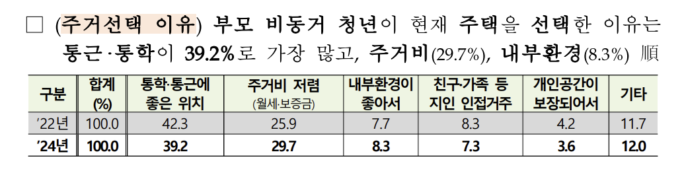
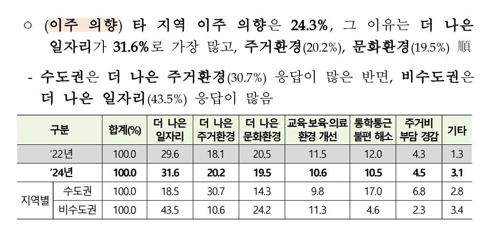
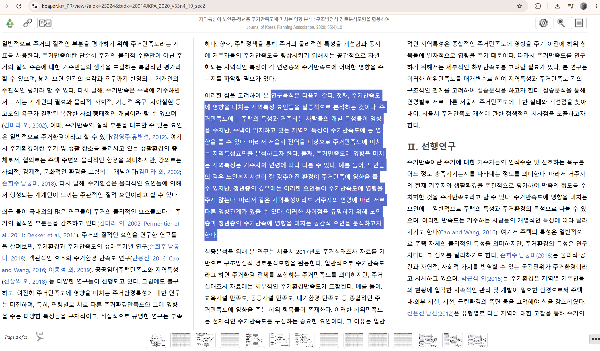
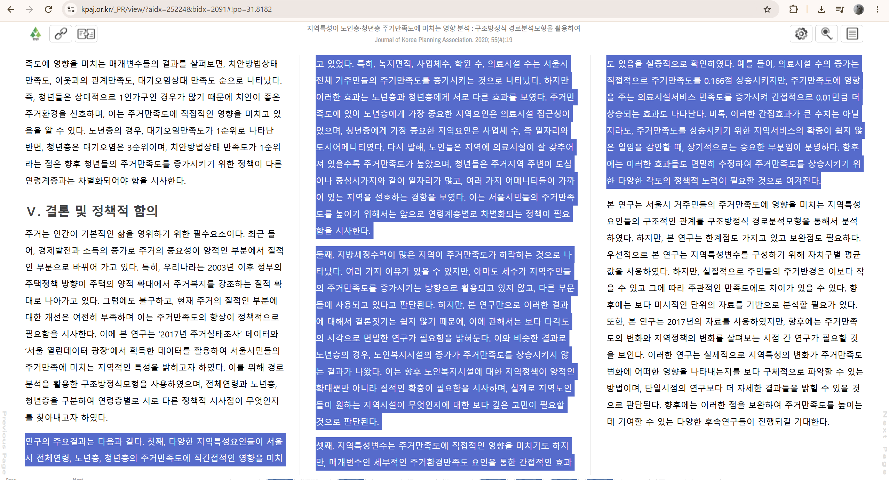
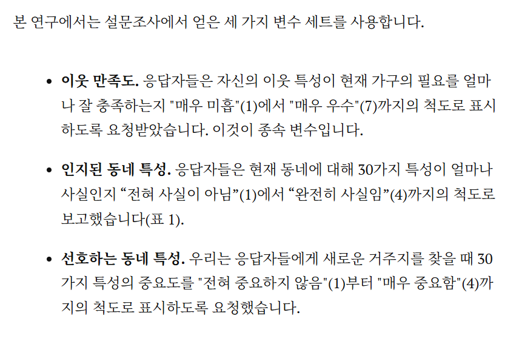
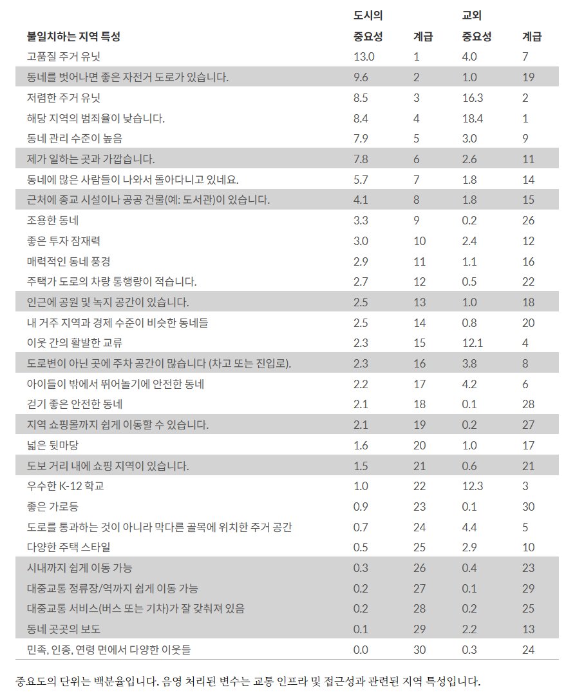

# 다양한 주거 선택 이유

부모와 따로 사는 청년들이 현재 주택을 선택한 이유에는 여러 종류가 있습니다. [참고자료 11페이지 - 4. 주거/주거선택 이유, 이주 의향](./01_datas/250311_'24년_청년의_삶_실태조사_결과_발표_보도자료%20(1).pdf)

# 사용자의 생활 양식과 주거신호 분석
사용자가 말한 내용을 벡터로 변환하는 역할을 맡길 수 있습니다.

> "나는 재택근무가 많고 시끄러운 곳을 싫어하지만, 카페는 가까웠으면 좋겠어. 밤늦게 들어오는 경우가 많아서 치안도 중요해."

> `조용함 0.95 / 치안 0.9 / 카페·상권 0.7 / 직주근접 0.3 ...`

# 지역 특성
**「지역특성이 노인층·청년층 주거만족도에 미치는 영향 분석」**에서 `2017년 서울시 주거실태조사`와 `서울 열린데이터광장 지역 데이터`를 결합하여 주거 지역별 만족도를 조사하였습니다.

사용 데이터는 다음과 같습니다.
- 사람(개인): `소득`, `교육`, `주택` 등
- 지역: `학원 수`, `사업체 수`, `5대 범죄`, `미세먼지`, `의료시설`

> [링크](https://kpaj.or.kr/_PR/view/?aidx=25224&bidx=2091#!po=31.8182)

# 주거지에 따른 만족도 조사 (교통 인프라)
> 국내 연구가 아닌 `Cao & Wu`의 미국 미네소타주의 최대 도시인 미니애폴리스(Minneapol공공임대주택과 민간임대주택의 주거 만족도 영향요인 및 차이 분석is)와 주도인 세인트폴(Saint Paul)을 함께 부르는 `Twin City`를 기반으로 한 연구입니다.

> 연구 과정이 구체적으로 담겨있진 않지만 결과는 명확합니다.

- [파일 링크](./datas/7209-exploring-the-importance-of-transportation-infrastructure-and-accessibility-to-satisfaction-with-urban-and-suburban-neighborhoods-an-application-of-g.pdf)
- [온라인 글 링크](https://findingspress.org/article/7209-exploring-the-importance-of-transportation-infrastructure-and-accessibility-to-satisfaction-with-urban-and-suburban-neighborhoods-an-application-of-g)

### 연구 결과 요약

### 수요기반의 주거생활공간 실태진단 방안(Ⅱ) - 청년가구 거주적합성 진단 지표 및 지수 개발
> 거주자가 체감하는 "살기 좋음"을 측정할 수 있는 `저층주거지 거주적합성 지수(RALI)`와 그 활용형으로 `청년 거주적합성 지수(Y-RaLI)`를 새롭게 개발한 내용입니다. ([링크](https://www.auri.re.kr/publication/view.es?mid=a10312000000&publication_id=2271&publication_type=research), [로컬 링크](./01_datas/[일반연구보고서%202025-8]%20수요기반의%20주거생활공간%20실태진단%20방안(Ⅱ)%20-%20청년가구%20거주적합성%20진단%20지표%20및%20지수%20개발.pdf))

- 지표별 검토 - pdf:[81, 82, 83], page:67, 68, 69
- 거주적합성 지수 - pdf:[95, 96, 97, ...], page:95, 96, 97, ...

### 공공임대주택과 민간임대주택의 주거 만족도 영향요인 및 차이 분석
> 구체적인 수치의 유의도를 확인합니다.

"시설 접근환경은 전체 주거환경 만족도와 유의한 관계를 보였다."

를 수치로 뒷받침하기에는 좋습니다.