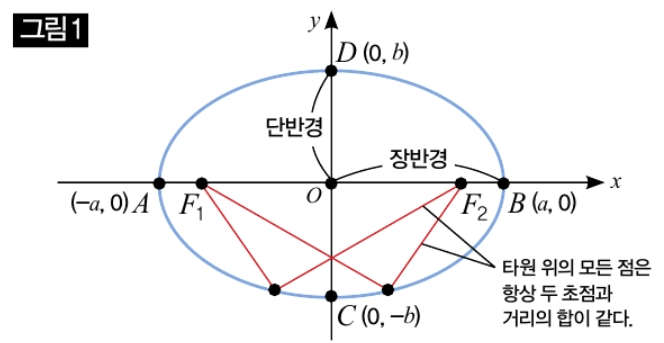

# [랭체인 중간프로젝트] 경로 생성 알고리즘 코드 읽으면서 이해하기
> 재빈님이 짜주신 시설 및 사용자 요구사항에 대한 경로 추천 알고리즘 폴더를 알아보았습니다.

## 전체적인 폴더 구조
폴더 구조를 먼저 까보면 총 2개의 폴더가 존재합니다.
```md
- code/
=====================================================
===                 경로 생성 계층                  ===
=====================================================
  - geo.py            # 기초 좌표 계산 도구
  - graph.py          # 도로 그래프 계산 도구 및 NetworkX/SciPy의 cKDTree 사용 계층
  - routing.py        # 실제 길찾기 계층
  - waypoints.py      # 임의 경유지 생성
  - course.py         # 코스를 하나 만드는 중심 함수
=====================================================
===                 경로 평가 계층                  ===
=====================================================
  - elevation.py      # 
  - scoring.py
  - nature.py         # 공원/하천 계산 계층
  - surface.py        # 도로 면 형태 계산
  - weight.py         # 기존 raw 데이터들을 score로 변경
=====================================================
===               서비스 제공 계층                  ===
=====================================================
  - pipeline.py
  - ranker.py
  - build_graph.py
  - draw_map.py
  - data/
    - 서울_보행네트워크.graphml # 진짜 xml 형태의 `<node>`와 `<edge>`로 이루어진 코드
    - 서울_보행네트워크.pkl # 파이썬에서 캐싱해놓는 바이너리 코드
=====================================================
===                 데이터 준비 계층                ===
=====================================================
- osm/        # 사전 데이터 준비용 폴더
  - build_osm_layers.py
  - fetch_park_water.py
  - out/
    - 서울_공원.geojson
    - 서울_하천_polygon.geojson
    - 서울_하천_line.geojson
```

## 사용된 라이브러리 종류
- NetworkX: 도로 그래프를 그려주고, 최단경로 등을 만들어줌. `nx`로 별칭을 달고 사용함.
- Scipy cKDTree: GPS와 가장 가까운 노드를 빠르게 찾을 수 있게 인덱싱
- pyproj: ESPG 좌표계에서 5179와 4326 좌표계를 변환하며 거리를 측정해줌
- GeoPandas: 공원/하천 등과 같은 데이터 관리
- pickle: G객체(`nx.MultiDiGraph`)를 캐싱하여줌

> 해당 라이브러리들에 대해서는 향후 한번씩 리뷰해보겠습니다.

## `2026-09-05` 기준 사용자의 요청 형태
```python
# 임시 요청값 설정해주기
start = (37.4979, 127.0276)   # 강남역
end = (37.5045, 127.0400)     # 역삼 방향, 직선 약 1.3km (ONE_WAY 용, 목표 3km 보다 짧아야 함)
weights = {"distance": 5, "elevation": 4, "toilet": 5,
    "store": 2, "park": 3, "night": 5}
requirements = {"toilet": True, "no_stairs": True}
cases = [
    ("LOOP", 3.0, {}),
    ("ONE_WAY", 3.0, {"end": end}),
    ("ROUND_TRIP", 3.0, {}),
    ("LOOP", 5.0, {"vias": [(37.5045, 127.0490)]}),   # 선릉역 경유 순환 5km
]
```

정리해보면
- 시작 위경도
- 종료 위경도
- 가중치 (시설들에 대한)
- 요구사항
- 경유 형태 및 지나는 지점
  - 경유 형태: `LOOP:loop`, `ONE_WAY:point_to_point`, `ROUND_TRIP:out_and_back`
  - 거리: km 단위
  - 지점들 데이터:
    - `end`: optional로 `ONE_WAY`인 경우에 제공
    - `vias`: optional로 지나가는 지점이 있을 경우에 제공

## 프로그램이 시작될 떄 먼저 준비되는 요소
- G: `graphml`의 경로를 따와서 동일한 폴더에 `suffix`만 변경해서 `.pkl` 파일로 저장한 뒤, `nx`를 이용해서 그래프 객체로 변경해주기
- idx: 커스텀 클래스 `NodeIndex` 객체로, `nx.MultiDiGraph` 객체를 인자로 받아서 이를 모두 `위경도 -> 5179 xy 좌표계`로 변경하여 cKDTree 객체로 인덱싱해둔 뒤, 위경도를 넣으면 가장 가장 가까운 노드의 `idx`를 반환해줌.

### 자주 쓰이는 형태의 인자들
- coords: `list[tuple[float, float]]` 형태의 객체
- vias: `liist[tuple[float, float]]` 경유지 리스트

## 사용되는 도구 모듈들
### 1. geo.py
`_geod = Geod(ellps="WGS84")`를 이용하여 몇가지 함수를 제공
- `point_at_bearing(lat, lon, 북쪽을_0도로_잡고_시계_방향으로_이동할_각도, 움직일_거리[m])`: 위경도를 기준으로 `?m` 이동했을 때의 위경도 튜플
- `harversine(coord, coord)`: 두 위경도 사이의 거리 (m)
- `bearing_deg(coord_1, coord_2)`: `coord_1`로부터 `coord_2` 를 바라보는 각도 (방위각 기준)

### 2. graph.py
도로 그래프를 담당하여 `G`객체와 `NodeIndex`를 잡아주는 주요 모듈입니다.

- `load_graph(graphml_file_path)`: `.graphml` 파일이 존재하는 경로를 받아서 `.pkl` 최신 캐싱파일을 만들어주고, `nx.read_graphml` 또는 `pickle.load(f)`(그래프 객체 직렬화를 다시 로딩) 방식을 통해 `NetworkX`의 그래프 객체를 반환합니다.
- `grid_graph(rows, cols, spacing_m, origin_시작_지점)`: `spaceing_m` 간격의 `rows*cols` 크기의 격자 모양의 그래프를 만들어줍니다. 테스트용 임시 함수입니다.
- `NodeIndex`: 클래스로 위에서 말한 G를 내부 속성으로 가지고, `self._tree=cDKTree(list[coord_5179])`를 이용하여 그래프를 실질적으로 저장하는 객체입니다. 
  - `snap(lat, lon)`: 해당 위치에 알맞는 G 인덱스를 반환합니다.

### 3. routing.py
실제로 길을 찾아주는 모듈입니다.

- `shortest_path(G, src_시작지점_nodeIdx, dst_도착지점_nodeIdx, penalty_edges_이미_지나간_경로들=None, factor_벌점_배율=5.0)`: 가장 가까운 거리를 가져오되, `penalty_edges`에 속하는 경로들을 계산할 때에는 `factor` 값을 곱해서 계산합니다. 반환하는 값은 `list[int]` 형태의 `nodeIdx` 배열입니다. 내부적으로 `nx.shortest_pathh`를 사용해줍니다.
- `_edge_len(data)`: `nx.shortest_path()`에 `weight`속성 콜백 함수 인자로 등록되는 함수. 내부적으로 `length` 속성을 뽑아서 반환해줌. 최종적으로 이를 비용 계산 기준으로 삼는셈.
- `edge_set(nodes)`: `list[int]`형태의 `nodeIdx` 리스트 형태의 경로를 받아서 내부의 모든 `edge` 정보를 `set[frozenset((idx_1, idx2))]`로 반환.


### 4. waypoints.py
필요시에 가상의 경유 지점을 생성해주는 모듈입니다.

- `circle_waypoints(lat, lon, radius_m_받은_위경도로부터_떨어져야하는_거리, n=1, start_bearing=0.0)`: 받은 인자의 위경도를 기준으로 `radius_m` 을 반지름으로 하는 원을 그려서 `start_bearing`을 시작으로 `n`개가 나오게끔 회전시키며 `list[coord](coord=tuple[float, float])`를 반환합니다.
- `ellipse_waypoints(start, end, target_sum_m, n=8)` 입력한 두 `coord`를 초점으로 갖는 타원에서 `n`개의 노드 후보를 반환합니다. 반환 형태는 `list[coord]` 입니다.

```md
# ellipse_waypoints의 구현 원리
해당 함수는 타원을 만드는 두 초점과 타원의 점과의 두 선분의 거리의 합은 항상 일정하다는 원리를 이용하였습니다.

함수 내부적으로 먼저 두 지점 (start, end)의 유클리드 거리를 계산한 뒤, 그를 반으로 나누어 저장합니다.

그리고 **장반경**이라는 타원의 긴 축의 절반길이를 `a`라고 설정하여 `PF_1 + PF_2 = target_sum_m(=2a)` 라는 특성을 이용합니다.

- a = 장반경
- c = end ~ start 의 유클리드 거리
- b = `sqrt(a^2 - c^2)` = 단반경(타원의 짧은 반지름) 

이후에는 sin과 cos, 그리고 초기 start/end의 각도를 이용하여 위경도를 잡아 반환해주게 됩니다.
```



### 5. course.py
위의 모듈들을 이용하여 본격적으로 코스를 만드는 모듈입니다.

주요 함수인 `generate_course`와 `generate_course_via`를 기반으로 몇몇 내부 함수가 존재합니다.

- `_route_chain(G, node_chain: list[coord], penelty: float)`: 이후 소개할 주요 함수인 `generate_course_via`에서 호출되며 모든 노드들을 이어주는 기본 경로를 생성해줍니다.
- `generate_course_via(G, idx, start, vias, target_distance_m, end=None,bearing=0.0, max_iter=6, tol=0.05, penalty=3.0):`: 경로를 하나 생성해줍니다. `vias: list[coord]`가 존재할 경우에 호출되는 함수로 내부적으로 `_route_chain`을 호출하여 오차율이 `tol`로 계산되어 사용자의 요청 거리가 너무 짧으면 에러, 오차율에 들어가면 반환, 오차율을 적용해도 사용자 요구거리에 미치지 못한다면 추가적인 경로 후보를 생성하게 됩니다.
- `_build(G, idx, mode, start, end, scale, bearing)`: 사용자 지정 경유지가 존재하지 않는 요청에 대해서 
  - `loop`: `circle_waypoints()`에서 첫번째 포인트를 마지막 포인트 삼아 중복 경로 벌점주며 생성
  - `out_and_back`: `circle_waypoints()`에서 첫번째 포인트를 왕복지점삼아 갔다와줍니다.
  - `point_to_point`: `ellipse_waypoints()`에서 사용자가 원하는 방향과 가장 가까운 각도로 경로를 지정해줍니다.
- `generate_course(G, idx, mode, start, target_distance_m, end=None, bearing=0.0, max_iter=6, tol=0.05)`: `_build` 함수를 이용하여 `max_iter`만큼 반복하여 최곡의 경로를 반환해줍니다.