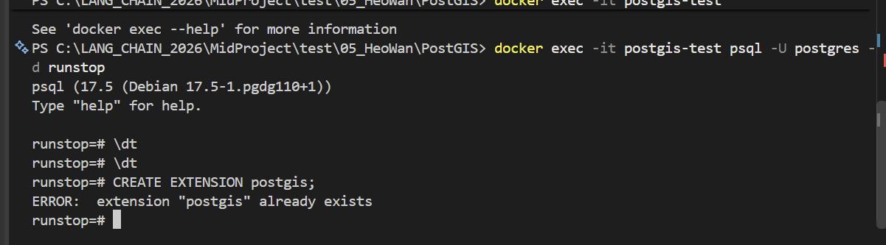
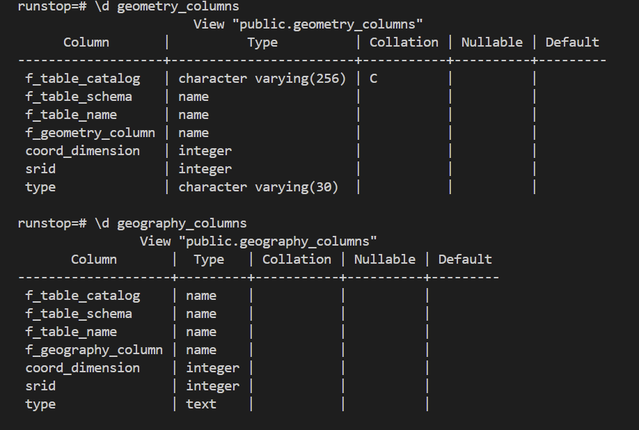

# [데이터베이스] PostGIS 확장 사용
> PostGIS에서 어떤 기능을 제공하는지와 문법에 대해서 알아보았습니다.

## 1. 도커로 PostGIS Extention이 달린 컨테이너 돌리기
현재 컴퓨터에 `PostgreSQL` 프로그램이 설치되어있지 않기 때문에 도커를 이용하여 `postgis/postgis:17-3.5` 버전을 받았습니다.

[도커 컨테이너 띄우기](../image.png)

명령어는 아래를 그대로 사용하였습니다.

```bash
docker run --name postgis-test -e POSTGRES_PASSWORD=postgres -e POSTGRES_DB=runstop -p 5432:5432 -d postgis/postgis:17-3.5
```

이후에 도커 컨테이너 내부의 `psql`에 `runstop`으로 접근 후 `version()`을 찍어 현재 버전과 기반 os 등을 확인하엿습니다. (리눅스에 17.5버전 이였습니다.)

이후에 이런저런 명령어를 사용해보며 어디까지 지원을 하는지 확인하였습니다.



> postgis가 이미 설치되어있는 이미지입니다.

## 2. PostGIS에서 확장된 요소들
해당 Extension은 `CREATE EXTENSION postgis`와 함께 카탈로그(`pg_catalog`) 스키마의 `pg_extension` 테이블에 `postgis`와 `pg_depend`에 PostGIS가 만든 객체들의 소속/의존 관계들을 넣어주게 됩니다.

현재 DB에 PostGIS가 설치되었다는 정보를 주게 됩니다.

### 타입
PostGIS의 가장 큰 요소는 타입입니다. 카탈로그의 `pg_type`에 저장되게 됩니다.

PostgreSQL에는 공간 관련 타입들을 굉장히 많이 제공해줍니다. 간단히 보면
- `box2d`: 2차원 경계 상자로 2개의 좌표를 기반으로 만들어집니다.
- `box3d`: 2축 높이까지 추가된 3차원 경계입니다. 2개의 좌표를 기반으로 만들어집니다.
- `geometry`: 기본적인 공간 객체로 산술 연산에 특화되어있습니다. 좌표계 위의 공간객체입니다.
  - `Point`: 좌표 하나입니다. 단위는 사용자 지정입니다. (아래 모두 공통)
  - `LineString`: 여러 점을 연결한 선
  - `Polygon`: 닫힌 면
  - `MultiPoint`: Point 집합
  - `MultiLineString`: 여러 LineString
  - `MultiPolygon`: 여러 Polyfon
- `geography`: 지구를 평면이 아닌 구체에 가까운 형태로 취급하여 연산하며 실제 거리를 계산할 때 많이 사용합니다.

여기에서 데이터베이스의 테이블에 `location geometry(Point, 4326)`와 같은 타입도 결국 `pg_type`에 등록되어있는 타입입니다.

공간 관련 `Table`과 `View` 또한 추가되게 됩니다.

대표적으로 `spatial_ref_sys` 테이블이 생성되어 `SRID:4326`과 `SRID:5179`과 같은 좌표계 Coordinate Reference System정보가 등록되게 됩니다. 대표적인 View로는 `geometry_columns`와 `geography_columns`가 존재하게 됩니다.



### Function
ST(`Spatial Type`)를 사용하기 위해선 `ST_*()`형태의 함수를 많이 사용하게 됩니다. 많이 사용하게 될 요소들을 나열하면

**기본 데이터 사용**
- `ST_MakePoint(a, b)`: 좌표계가 등록되지 않은 `(a, b)`를 `Point`로 만들어줍니다.
- `ST_GeomFromText(함수 텍스트, SRID 좌표계 코드)`: WKT(Well-Known Text)를 `geometry`로 변경해주게 됩니다. `POINT(A B)`, `LINESTRING(A B, A B, ...)`, `POLYGON((A B, A B, A B, ...))` 등과 같이 사용이 가능합니다.
- `ST_SetSRID(대상 geometry 객체, SRID 코드)`: `geometry`타입을 특정 좌표계 설정을 합니다. `set`에 가까운 설정이여서 `(경도, 위도)`에 `SRID:5179`을 설정한다고 좌표축으로 재계산되지 않습니다.

**Geometry 정보 확인**
- `ST_AsText(geometry)`: `geometry`를 WKT 문자열로 변환해주게 됩니다. 바로 사용 가능한 형태가 아니기 때문에 디버깅용으로 많이 쓰입니다.
- `ST_X(geometry)`, `ST_Y(geometry)`: `geometry`에서 x, y 값을 꺼냅니다. 
- `ST_SRID(geometry)`: `geometry`의 SRID 코드를 꺼내게 됩니다.
- `ST_GeometryType(geometry)`: `geometry`의 종류를 확인합니다. `ST_Point`, `ST_LineString`, `ST_Polygon`등과 같이 출력이 됩니다.

**두 geometry 비교**
- `ST_Distance(geom1, geom2)`: 두 `geometry` 사이의 거리를 구합니다. 두 `geometry`의 타입이 달라도 구해지며 기본적으로 동일한 `SRID`이여야 합니다. 
- `ST_DWithin(geom1, geom2, distance)`: 두 `geometry`의 거리가 `distance`보다 작으면 `TRUE`을 반환합니다.
- `ST_Intersects(geom1, geom2)`: 한 지점이라도 겹치거나 교차하면 `TRUE`를 반환합니다.
- `ST_Contains(geom1, geom2)`: `geom1`이 `geom2`를 포함하는지를 확인하여 `boolean`을 반환합니다.
- `ST_Within(geom1, geom2)`: `ST_Contains`의 반대로 `geom1`이 `geom2`안에 포함되면 `TRUE`를 반환합니다.
- `ST_Touches(geom1, geom2)`: 내부가 겹치지 않고 **경계가 접하는지** 확인합니다. `Point` 역시 사용이 가능하지만 꼭짓점이 아닌 선 위에 올라가야만하면 `Point` 2개는 사용이 불가능합니다.

**좌표계 변환**
- `ST_Transform(geometry, SRID)`: 내부의 `Point` 값과 `SRID`를 함께 변경합니다.
- `ST_Buffer(geom, distance)`: 주변에 지정한 `distance`만큼 버퍼 영역을 만들어 `Polygon` 형태로 만들어줍니다.
- `ST_Union(geom1, geom2)`: 두 `geometry`를 하나의 공간 객체로 합칩니다.
- `ST_Intersection(geom1, geom2)`: 두 `geometry`가 겹치는 부분만 추출합니다. 경우에 따라 `GeometryCollection` 형태로 반환됩니다.

## 3. Operator
`geom1 && geom2` 연산을 추가하여 두 `geometry`의 bounding box가 겹치는지 검사하게 됩니다.

이 또한 `pg_operator`에 추가되게 됩니다.

## 4. 공간 Index
공간을 분할하여 나눈 후 `geometry`에 대한 검색을 빠르게 검색하게 할 수 있습니다.

이를 이용하여 `ST_DWithin(A, 비교 대상, 500)=TRUE` 와 같은 조건문을 빠르게 검색할 수 있게 됩니다.

