`2026-08-29 16:44:41`

# TypeScript
현재 DTO 사용을 위해 타입스크립트 도입을 고려중입니다.

서버 구조를 먼저 잡아주기 위한 인터페이스가 중요한 단계이기 때문에 이를 가능하게 해주는 타입스크립트를 도입하려 합니다.

## 환경 고려
일단 node 및 npm 버전이 동일해야합니다.

- node: `v24.18.0`
- npm: `11.16.0`

## 단순한 테스트
1. `npm install -D typescript tsx @types/node`
2. `npx tsc --init`
3. `src/index.ts` 코드 작성
4. `npx tsx src/index.ts`

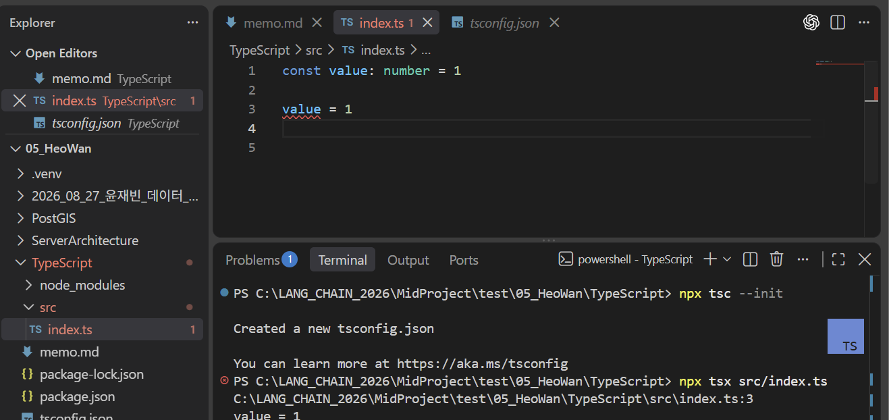

> 위와 같이 일반적인 `js`와 다르게 정적 파일검사 경고가 나오며 빌드 시 에러가 타입 에러가 납니다.

## 명령어의 의미

### `-D`
`--save-dev`라는 의미로 `pagckage.json`에 `devDependencies`에 패키지 정보가 추가됩니다. (보통 `dependencies`입니다.)

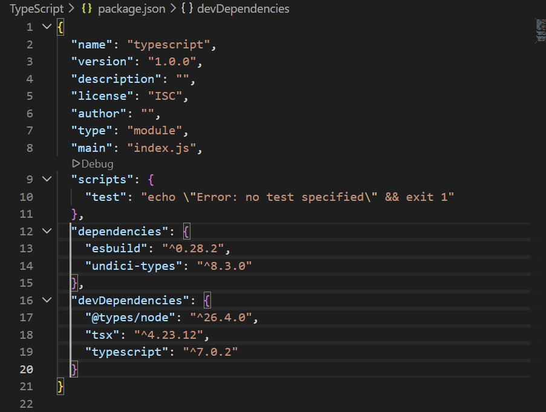

### `typescript`
**TypeScript 컴파일러**를 설치합니다.

해당 컴파일러를 이용하여 VSCode가 실시간으로 정적 파일 검사를 할 수 있으며 직접 `tsc` 명령어를 이용할 수 있습니다.

### `tsx`
`tsx`라는 프로그램을 설치합니다.

`tsx`는 `npx tsx src/index.ts`와 같은 명령어를 이용하여 직접 `npx tsc`, `node dist/index.js`를 할 필요 없이 바로 실행이 가능합니다.

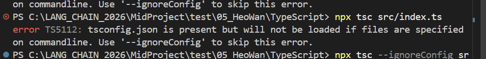

### `@types/node`
`Node.js` 환경에서 제공하는 API인 `node:fs`, `process`, `Buffer` 등은 JavaScript에서 기본으로 제공하는 기능이 아니기 때문에 이를 알기 위해서 `@types/node`를 이용하여 해당 기능들에 대한 TypeScript 타입 설명서를 알 수 있습니다.

### `npx`
`npx`는 설치된 패키지의 실행 파일을 실행한다는 의미입니다. 아래 이미지에 설치된 `tsc` 등과 같은 파일을 실행하는 프로그램입니다.

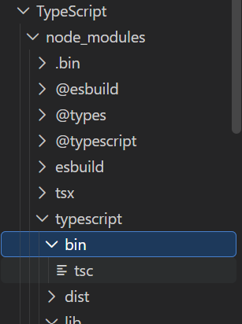

`tsc`는 TypeScript 프로젝트를 검사하고 설정에 따라 JavaScript를 생성하는 공식 컴파일러입니다.

### `--init`
TypeScript 설정 파일을 처음 만들라는 옵션입니다.

해당 설정파일은 보통 `tsconfig.json`의 형태이며 이는 TypeScript 컴파일러에게 주는 설정파일입니다.

### `npx tsc`
`tsconfig.json`을 읽어서 프로젝트를 검사 및 컴파일하게 됩니다.

`tsconfig.json`에 `{ "compilerOptions": { "outDir": "./dist" } }` 로 설정해둔다면 `dist/` 폴더에 파일이 생성되게 됩니다.

### 변수
`let var: type = typeVar` 와 같이 사용이 가능하며 다른 타입을 쓰게 된다면 빌드 또는 테스트 시 에러가 나게 됩니다. 타입을 작성하지 않아도 자동 타입추론이 일어나게 됩니다.

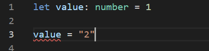

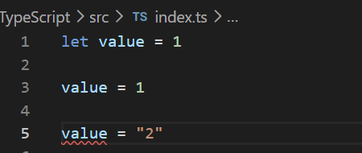

### 함수 시그니처
`function func(a: number, b: string): object {...}`와 같이 사용 가능합니다.

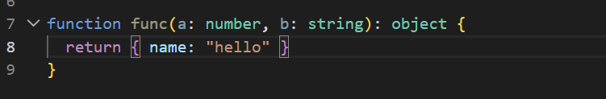

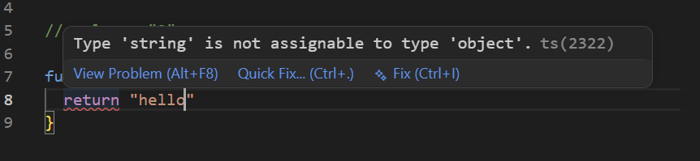

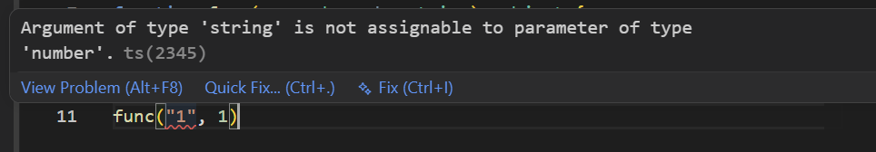

### 객체 타입
일반객체의 키들에 대한 속성을 줄 수 있습니다.

이를 활용하여 여러가지 작업이 가능하게 됩니다.

다음은 사용자 및 팀을 만드는 예시입니다.

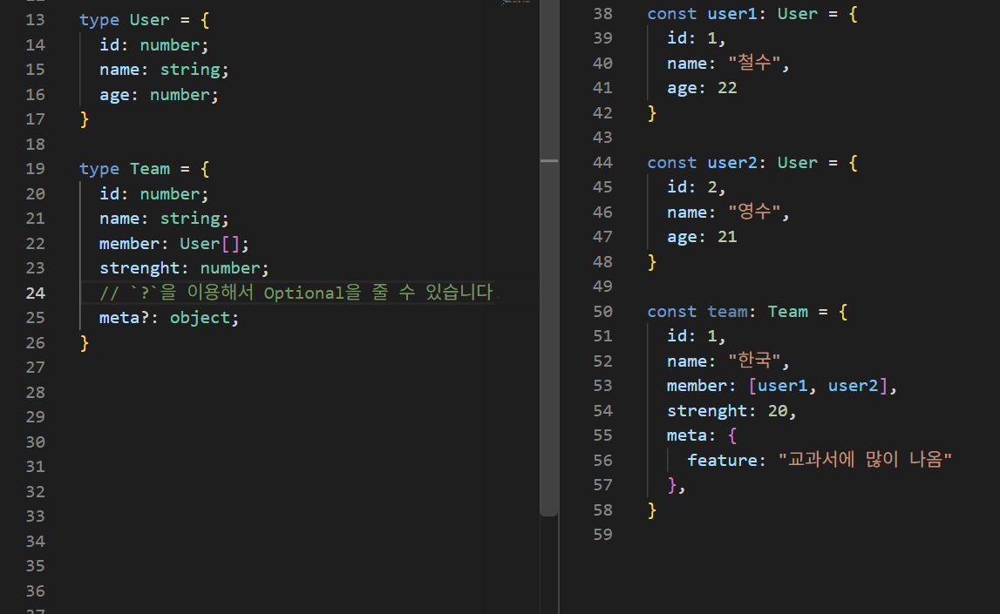

Enum과 같은 방식의 사용 또한 가능합니다.

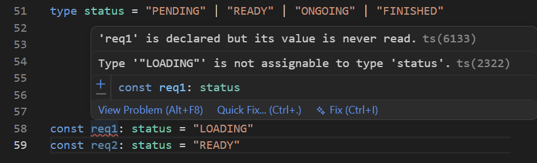

타입을 2개 이상 줄 수 있으며 배열 순서도 지정할 수 있습니다.

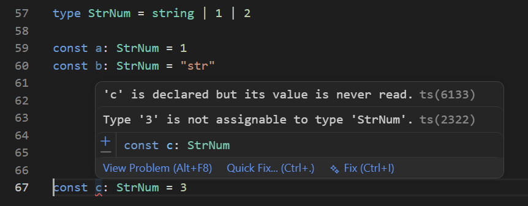

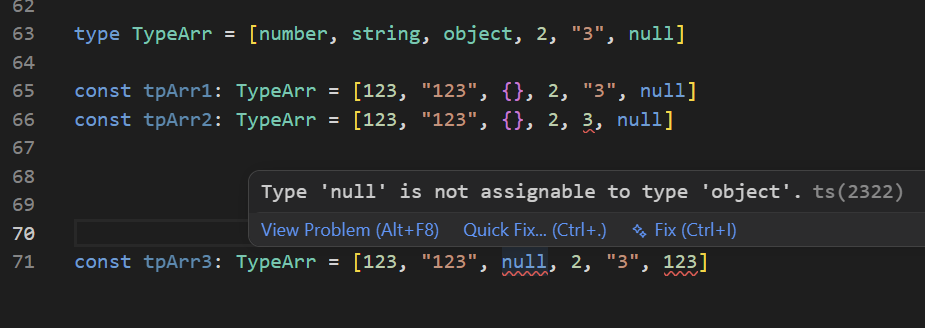

### 함수가 아닌 변수 인터페이스
위에서 설명한 `type`는 타입에 이름을 붙이는 것입니다.

기존 타입에 표현식에 이름을 붙이는 방식입니다.

인터페이스는 기본적으로 **객체의 구조를 정의하는 용도**이며 **같은 이름을 다시 선언**할 수 있습니다.

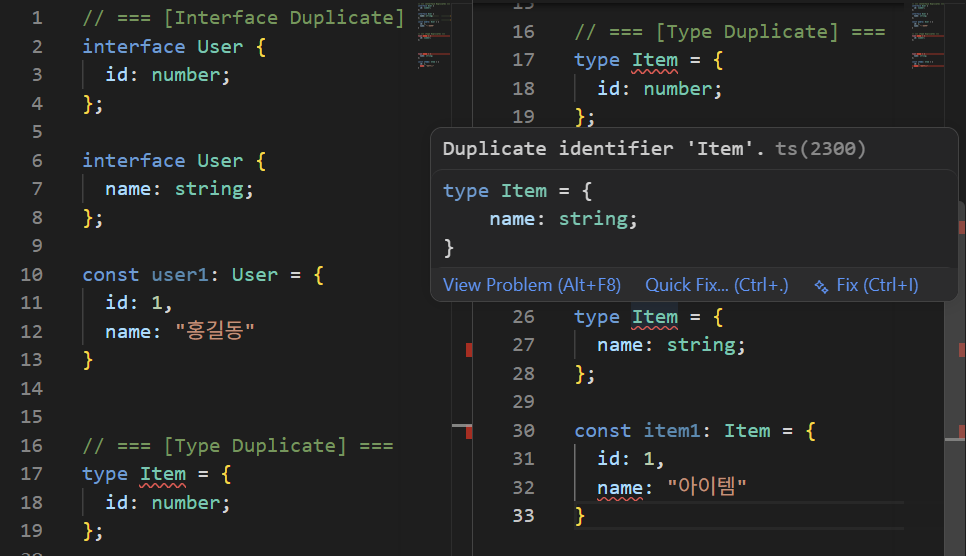

또한 두 인터페이스를 합쳐서 사용하는 **Declaration Merging** 같은 문법 또한 사용할 수 있습니다.

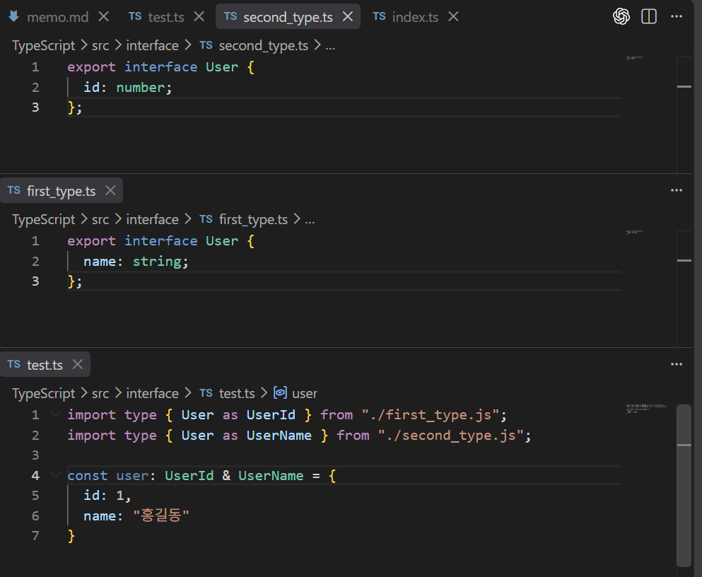

### 함수 인터페이스
함수의 경우에는 **call signature**를 이용하여 정의할 수 있습니다.

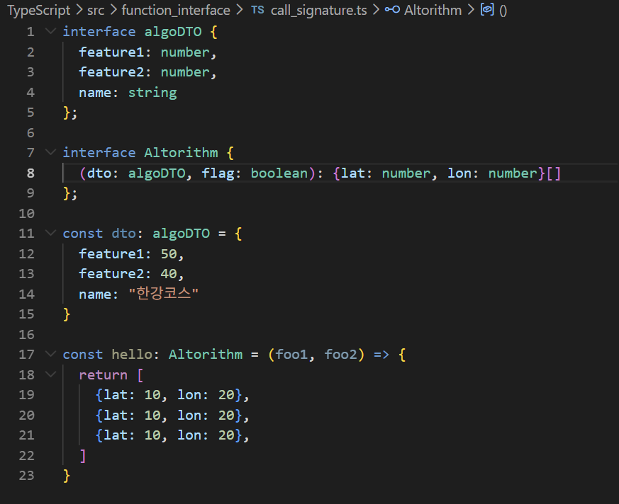