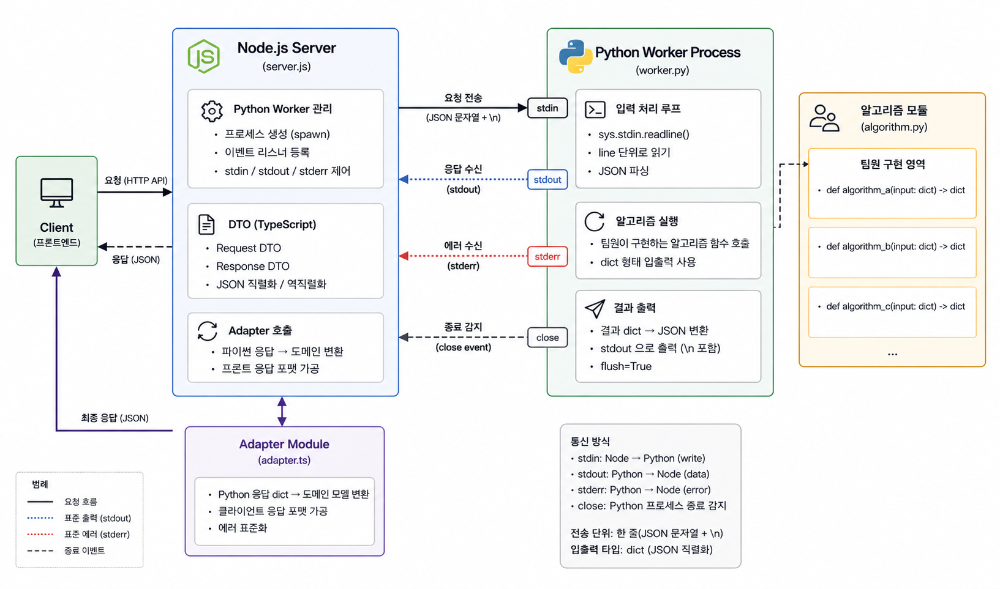

# [랭체인 중간프로젝트] 노드와 
> 현재 프로젝트에서 사용할 기술중 하나인 워커 기술을 공부했습니다.

## 목차
- [현재 상황](#current-status)
- [코드](#code)
  - [Node `server.js` 코드](#node-server-js)
  - [Python `worker.py` 코드](#python-worker-py)
- [이를 적용할 방법](#application-plan)
  - [요약표 이미지](#summary-image)

<a id="current-status"></a>

## 현재 상황
현재(2026-08-29) 프로젝트 기획이 끝난지 약 7일이 되었으며, 프론트 및 알고리즘을 구체화하며 저는 서버 구조를 잡고있는 상황입니다.

하지만 주먹구구식으로 에러를 해결하는 것이 아닌 최대한 명세화를 해야한다 생각하였기 때문에 기술을 먼저 공부하기로 하였습니다.

이번에 먼저 공부한 것은 저희의 API 서버인 노드 서버에서 하위 프로세스로 파이썬 프로세스를 생성한 뒤 통신, JSON 직렬화, 에러 처리 등에 대한 코드를 직접 사용해보았습니다.

<a id="code"></a>

## 코드
> 바로 코드로 넘어가겠습니다.

일단 기본적으로 볼 수 있는 코드는 2가지 입니다.

- **Node server.js**: 파이썬 프로세스를 생성, `\n`을 마지막으로 파이프 버퍼에 JSON 직렬화 문자열을 넣어 파이썬에서 읽을 수 있게 해주는 코드
- **Python worker.js**: 노드에서 실행하는 파이썬 스크립트. 이곳에서 여러 함수를 선택하여 테스트
- **Python test.js**: 테스트할 여러 함수들을 등록해놓는 공간

<a id="node-server-js"></a>

### Node `server.js` 코드
```js
// 자식 프로세스를 생성해주는 child_process 모듈의 함수
import { spawn } from "child_process"
import { workerData } from "worker_threads"

// # Node stdin에 `python ../python/worker.py`를 입력해주어 프로세스 생성
//  [이때 일어나는 일들]
// - 파이썬 프로세스 생성
// - 파이썬 프로세스에 fd[0, 1, 2] 생성
// - Node에 파이썬의 fd[0, 1, 2] 생성
const pythonWorker = spawn("python", ["../python/worker.py"])

// # [파이썬 이벤트 등록]

// ## 1. 파이썬 출력 fd[1]가 바라보는 버퍼 메모리를 구독하기
pythonWorker.stdout.on("data", (data) => {
  // 기본적으로 파이프/버퍼에는 byte stream인 Buffer 객체가
  // 존재하기 때문에 .toString()로 바꿔주기
  console.log("[Python Worker] [onData]:", data.toString())
})

// ## 2. 파이썬 에러 출력 fd[2]가 바라보는 버퍼 메모리를 구독하기
pythonWorker.stderr.on("data", (data) => {
  console.log("[Python Worker] [onError]:", data.toString())
})

// ## 3. 파이썬 프로세스 종료 감지하기
pythonWorker.on("close", (code) => {
  // 종료 코드를 출력해주기
  // code: number이며 signal로 종료되면 null이 될 수 있음
  //   0: 정상 종료
  //   1: 오류 종료
  //   2+: 프로그램에서 원하는데로 정의
  console.log("[Python Worker] [onClose]:", code)
})

// 파이썬 프로세스 객체의 fd[0]의 pipe buffer에 write(fd[0], 내용) 하기
pythonWorker.stdin.write("hello\n")

const wait = async function(time) {
  await new Promise(resolve => {
    setTimeout(() => resolve(), time*1000)
  })
}

for(let i=0;i<10;i++) {
  await wait(1)
  
  // pythonWorker.stdin.write("message\n")
  if(Math.random() >= 0.7) {
    pythonWorker.stdin.write(Buffer.from([1]))
    pythonWorker.stdin.write("\n")
  } 
  else if(Math.random() >= 0.4) {
    pythonWorker.stdin.write("{ads, f: dfs}\n")
  }
  else {
    const request = {
      "node_a": "something",
      nodeb: "second",
      nodec: 341.23
    }
    pythonWorker.stdin.write(JSON.stringify(request) + "\n")
  }


  console.log("[Node] healthcheck")
}

pythonWorker.stdin.end()

// process.exit()
```

<a id="python-worker-py"></a>
### Python `worker.py` 코드
```py
# worker.py
# 우리가 만들 알고리즘이 들어간 실시간으로 켜져있을 워커
# 
from algorithm import test1, test_recover, test_json

# action = test1
# action = test_recover
action = test_json

action()


print("process end")
```

```py
# test.py
import time
import sys
import random
import json
from json import JSONDecodeError

def test1():
  """동시성 테스트"""
  for i in range(3):
    time.sleep(3)
    # 파이썬 프로세스 버퍼에 "hello"를 출력해놓고 
    # flush=True를 통해 즉시 stdout(fd[1])로 flush 해두기
    #  -> 최종적으로 Node의 python.stdout(fd[4])에서 받게됨 
    #     (0, 1, 2가 노드 표준, 3, 4, 5가 파이썬 표준이라는 가정 하에)
    print("hello", flush=True, end="")

def test_recover():
  """파이썬에서 에러가 날 경우 처리하는 것에 대한 테스트"""
  err_count = 0
  for line in sys.stdin:
    try:
      # \r, \n, 공백 제거
      line = line.strip()

      # 내용이 없으면 pass
      if not line: 
        continue  
        
      # 에러 재현
      if random.random() >= 0.5:
        err_count+=1

        # 비정상 감지 예시
        if err_count > 3:
          print("not normal", flush=True, end="")    
          # 프로세스 자체를 꺼버리기 (code: 1)
          sys.exit(1)

        raise Exception(f"error occured: {err_count}")

      # 받았음을 나타내기
      print(line + " recieved", flush=True, end="")
    except Exception as e:
      print(e, flush=True, end="")


def test_json():
  """Node에서 python.stdin에 json 직렬화를 주는 경우에 이것을 받는 테스트"""
  for line in sys.stdin:
    line = line.strip()

    line_parse: dict = {}
    
    try:
      line_parse: dict = json.loads(line)
    except TypeError:
      print("request must be json. request:" + str(line), flush=True, end="")
      continue
    except JSONDecodeError as e:
      print("JSON Format Error:" + str(line), flush=True, end="")
      continue

    line_parse["created_by_python"] = " ".join([
      str(value) for value in line_parse.values()
    ])

    print(json.dumps(line_parse), flush=True, end="")
```


<a id="application-plan"></a>

## 이를 적용할 방법
일단 알고리즘 함수를 만들어서 입출력을 파이썬의 `dict` 타입으로 만들 생각입니다.

파이썬은 알고리즘 팀의 영역이므로 구체적인 DTO 클래스는 만들지 않을 것이며 명세서를 통해서 향후 채울 계획입니다.

노드서버에서는 TypeScript를 도입하여 DTO 타입을 만든 뒤, 그 클래스를 JSON 직렬화하여 파이썬으로 보내고 응답받는 코드를 미리 만들어 둔 뒤, 이후 알고리즘팀의 명세가 끝나면 바로 이어붙여서 Adapter 모듈을 이용해서 프론트로 응답 가능한 형태로 가공할 생각입니다.

<a id="summary-image"></a>

### 요약표 이미지

